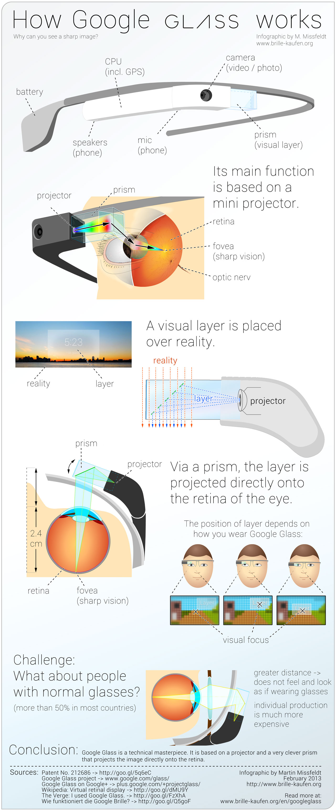

+++
title = "Comment marchent les Google Glass ?"
slug = 'comment-marchent-les-google-glass'
aliases = ['/post/comment-marchent-les-google-glass']
date = '2013-08-31T17:11:02.000Z'
draft = false
tags = ["infographie","google","glass","explication"]
image = 'featured.jpg'
+++

Je suis vraiment impressionné par ces lunettes qui permettent de faire pratiquement n'importe quoi, n'importe quand, n'importe où. Mais si je vous en parle aujourd'hui c'est parce que j'ai découvert une superbe infographie réalisée par Martin Missfeldt, qui nous explique comment fonctionne ce super gadget. Je vous conseille d'ailleurs de faire un petit tour à la [source](http://www.brillen-sehhilfen.de/en/googleglass/).

Pour vous laisser imaginer les possibles dérapages de ce type d'appareil je vous propose aussi de regarder cette vidéo par notre cher Gonzague :

<iframe width="640" height="360" src="//www.youtube.com/embed/hOPWsh-DFUs" frameborder="0" allowfullscreen=""></iframe>

Si vous ne comprenez pas quelque chose dans cette infographie, demandez moi, j'essayerai d'y répondre !

See you next time :)

PS: J'aimerai vous proposer une infographie réalisée par mes soins, vous avez des idées ? Postez tout ça en commentaire.
