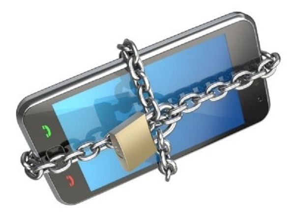

+++
title = "[Dossier] Android vs iOS : la confrontation"
slug = 'dossier-android-vs-ios-la-confrontation'
aliases = ['/post/dossier-android-vs-ios-la-confrontation']
date = '2013-08-18T09:46:39.000Z'
draft = false
tags = ["comparaison","ios","android","systeme"]
image = 'featured.jpg'
+++

#### **Prêts pour une nouvelle confrontation ? Aujourd’hui ce sont les systèmes d’exploitation mobiles iOS et Android que je vais confronter.**

Voici les principales caractéristiques que je vous propose de comparer :

*   \- Ergonomie de l’interface
*   \- Accessibilité de l’interface
*   \- Performance – Vélocité du système
*   \- Fluidité de l’interface
*   \- Design de l’interface
*   \- Contrôle des permissions (qui accède à vos données)
*   \- Contrôle des performances de l’appareil
*   \- Magasin d’applications
*   \- Rapidité de démarrage du système
*   \- Sécurité du système

### **Ergonomie de l'interface**

Le premier point dont je vais vous parler est pour moi l’un des plus important. Il a un impact direct sur l’avis du consommateur et c’est par ailleurs grâce à une **ergonomie** particulière qu’il va faire tel ou tel choix. Dans notre cas iOS propose une interface très claire sans menus cachés, toutes les applications sont là, vous gardez le contrôle d’un simple regard. De l’autre côté Android joue en fonction des surcouches des constructeurs, même si, en général, on nous propose un accueil et un menu pour les applications accessible en cliquant sur l’icône prévue à cet effet. Android propose trois interfaces légèrement différentes entre les smartphones, les phablettes et les tablettes qui permettent une facilité d’utilisation plus intéressante. Pour conclure, l’interface d’iOS sort vainqueur par son coté plus simpliste et user-friendly. **VICTOIRE D’IOS**

****

### **Accessibilité de l’interface**

Si l’ergonomie, la facilité d’utilisation, joue un rôle important dans le choix du système, son accessibilité en joue un autre. En effet, de nombreuses personnes sont malvoyantes, malentendantes… ont des problèmes pour toucher le smartphone au bon endroit. Il faut donc une assistance pour l’utilisation du système. Dans les deux cas, cette assistance remplie complétement sa part du contrat. **EGALITE**

### **Performance – Vélocité du système**

Parlons chiffre, parlons matière… Et oui, contrairement à ce que font la majorité des gens, il ne faut pas comparer la puissance de l’iPhone avec les autres terminaux Android. En effet, l’iPhone est bien moins puissant que le Samsung Galaxy S4 et pour cause, les deux systèmes d’exploitation ne demandent pas les mêmes ressources. iOS est en effet beaucoup plus léger qu’Android. Cependant, il faut noter qu’en matière de jeux vidéo la carte graphique ne dépend pas du système. **VICTOIRE D’IOS**

### **Fluidité de l’interface**

Petit point mais pas des moindres, la fluidité de l’interface. Pour les deux, on est sur une fluidité qui va dépendre principalement de la puissance de l’appareil utilisé. Mais on peut dénoter des petits plus chez l’un qu’on regrette de ne pas avoir chez l’autre. Sur iOS quand on double tape sur la barre de statut, on remonte en haut de page, c’est extrêmement pratique. Sur Android, il est possible de modifier les animations, les transitions entre les pages vers un style plus fluide. Il est aussi possible en accédant aux paramètres développeurs, d’accélérer la vitesse des animations. **EGALITE**

### **Design et personnalisation de l’interface**

« Il est trop beau ton téléphone ! » Le design, c’est un style unique. Si sur iOS on  est obligé d’avoir le design d’Apple classique (qui va changer dans très peu de temps avec le passage à iOS7), Android se démarque. Et pour cause, sur Android il est possible de modifier l’apparence de son terminal de la tête au pied, tout est entièrement modifiable et presque gratuitement. Vous pouvez ajouter autant de widget que vous souhaitez, afin d'afficher la météo, l'heure, les réglages rapides...  Sur iOS en revanche, il faudra vous rabattre sur le jailbreak avec WinterBoard pour customiser votre design. **VICTOIRE D’ANDROID**

### **Contrôle des permissions (qui accède à vos données)**

« Mes datas me lâcheront pas ! » Oui, oui, vos chères données personnelles sont très convoitées par les sociétés et il va falloir montrer les crocs. Sur ce point pas de doutes, c’est Android qui remporte la partie en vous listant lors de l’installation tout ce que pourra faire l’application. Aucun élément ne peut être masqué, car c’est une sorte de frontière qui accorde tel ou tel droit d’accès à l’application. Ensuite, tout comme iOS, l’application vous demandera si elle peut accéder à vos photos, votre carnet de contacts… Il est possible restreindre l’accès à vos données sur certaines versions d’Android. Notez qu’iOS7 rectifiera un peu le tir en vous demandant plus d’autorisations. **VICTOIRE D’ANDROID**

### **Contrôle des performances de l’appareil**

Overclocker, underclocker, tout cela est possible sur Android, à condition d'avoir rooté votre téléphone. Vous pourrez ainsi modifier les fréquences de votre processeur, gérer votre ram à l’aide de TaskKillers… Pour un utilisateur classique qui ne souhaite pas débloquer son téléphone, cela est totalement impossible pour les deux OS. **EGALITE**

### **

Magasin d’applications**

Le store d’applications est une sorte de gouffre immense où l’on trouve tout est n’importe quoi. Si le Play Store d’Android prend largement le dessus face à l’AppStore d’Apple en termes de téléchargement, ce dernier est plus fourni en matière de jeux vidéo notamment. Les applications semblent aussi, plus triées et sélectionnées que sur le PlayStore. De ce fait, je préfère vraiment le magasin d’Apple. **VICTOIRE D’IOS**

### **Rapidité de démarrage du système**

LOADING… LOADING… Comparons ce qui est comparable ! Pour ce test j’ai choisi d’un côté un Galaxy S3 et de l’autre un iPhone5 et un iPad 2. Et, il faut avouer qu’Android reste le plus rapide, iOS reste longtemps bloqué sur cette petite pomme. Chacun comparera de son côté, mais de ce point de vue, je suis pro-Android. **VICTOIRE D’ANDROID**

### **Sécurité du système**

BE SAFE ! Virus, trojans, cheval de troie… Si iOS se présente comme un système hyper sécurisé, ce n’est pas totalement vrai. Les menaces arrivent parfois de là où on les attend le moins : votre boite mail. Du côté d’Android, même problème, malgré le fait que l’on est pris ses précautions avec quelques antivirus qui témoignent de la facilité d’installation d’applications piratées. **EGALITE**

Ce n’était pas réellement prévu lors de l’écriture de l’article mais **les deux systèmes arrivent à égalité à la fin de cette comparaison**. Pour conclure, si vous etes un professionnel surchargé de travail ou que vous souhaitez une interface très simpliste, choisissez iOS. Si vous aimez tout customizer et vous amuser ou que vous n’avez pas les moyens d’acheter un appareil pommé, choisissez Android.

J’espère que vous avez aimé cet article, si c’est le cas, commentez le :-)

Et je vous dis « see you next time » !
