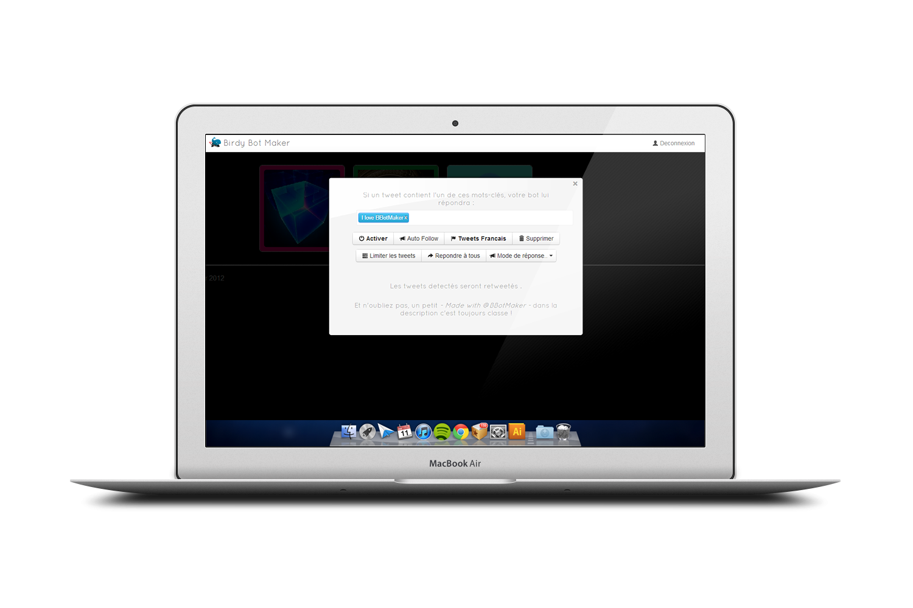
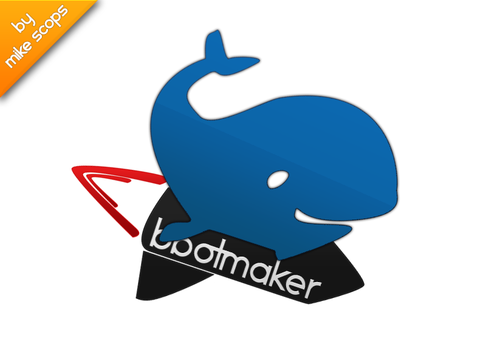

+++
title = "Mes ptits boulots : BBotMaker"
slug = 'mes-ptits-boulots-bbotmaker'
aliases = ['/post/mes-ptits-boulots-bbotmaker']
date = '2013-08-31T08:48:09.000Z'
draft = false
tags = ["job","bbotmaker","twitter","bot"]
image = 'featured.PNG'
+++

**Si vous êtiez là avant, vous vous souvenez peut être de PixelSwap comme un site d'actu un peu plus dynamique qu'il n'est aujourd'hui, mais il faut savoir faire des sacrifices pour pouvoir faire plus de choses à côté. Et je vais donc vous parler d'un logo que j'avais réalisé pour BBotMaker.**

[BBotMaker](http://bbotmaker.com) c'est tout d'abord un système pour créer des bots automatiques pour twitter, capable de répondre à vos nombreux abonnés. Mais un site, aussi bien, sans mascotte n'est pas un site bien _(tournure complétement foireuse mais vous avez compris)_. Voilà pourquoi je me suis trouvé face à Photoshop en train de réaliser une baleine sur une fusée... C'est un travail sympas à faire qui permet de découvrir en soi un talent caché pour le dessin d'animaux, ou pas...

Voici le résultat, n'hésitez pas à critiquer de manière positive ou négative certains points :

Dans très peu de temps vous retrouverez de nouveau BBotMaker sur PixelSwap, car je suis très heureux d'être son partenaire !
