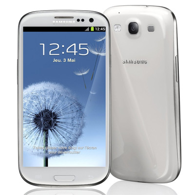

+++
title = "Mon passage d'iOS à Android"
slug = 'mon-passage-dios-a-android'
aliases = ['/post/mon-passage-dios-a-android']
date = '2013-08-12T11:16:16.000Z'
draft = false
tags = ["ios","android","changement","passage","os","systeme","avis"]
image = 'featured.jpg'
+++

J'ai toujours été un fervent utilisateur des produits de la marque Apple : iPod Nano, iPad, iPhone… Si je préfère néanmoins Windows à Mac OSX (simple dérivé commerciale de Linux), les petits appareils de la marque à la pomme m'ont toujours satisfait grâce à leur ergonomie à la fois matérielle et logicielle et grâce à leur prise en main facile.

Cependant, j'ai dû récemment changer de téléphone portable. Le choix était sans appel : pas d'iPhone car celui-ci est beaucoup trop cher et va subir (oui je dis bien subir) une mise à jour vers l'iOS 7 (je vous laisse vous informer ailleurs de la polémique). J'ai donc choisi un produit sud-coréen : un Samsung Galaxy S3 sous Android 4.1.2.

Le S3 est un produit de grande qualité, au niveau des matériaux. Nous sommes certes sur du plastique souple pour la coque mais qui ne présente aucun jeu, tous les éléments sont bien fixés entre eux. La taille de l'écran m'a surpris face aux standards d'Apple. Nous avons à faire à un écran Super Amoled HD de 4.8 pouces, doublé d'un Gorilla Glass. Il offre donc un affichage très lumineux et résistant. La particularité de l'Amoled vient du fait que les pixels noirs sont en réalité des leds éteintes. Il y a donc 0 consommation avec un écran totalement noir, on peut dire merci pour la batterie. A ce propos, cette dernière est correcte, avec l'utilisation intensive que j'en fais, celle-ci tient environ 1 journée, nuit comprise.

Je ne suis pas là pour vous parler des spécifications de ce téléphone mais bien du système Android. Pour que chacun soit satisfait des futurs tests que je vais faire, j'ai supprimé la surcouche du constructeur, la Touchwizz vers une rom AOSP 4.2.2 (Android Open Source Project) se rapprochant de l'expérience d'un Nexus de Google.

C'est déjà la fin de cet article et voici le programme, la suite des événements :

*   Android vs iOS : je comparerais de manière objective les deux systèmes pour que, en fonction de votre profil, vous puissiez faire le meilleur choix.
*   Quizz : vous ne savez pas quel OS choisir ? Suivez ce quizz et je vous dit ce qu'il vous faut.
*   Root, Rom, Flash qu'est ce que c'est ? Vous saurez enfin vous distinguer en public sur ce sujet.

See you next time, Corentin.
