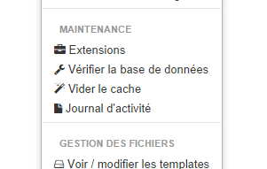

+++
title = "Configurer Bolt avec une base de donnée SQLite ou MySQL"
slug = 'configurer-bolt-avec-une-base-de-donnee-sqlite'
aliases = ['/post/configurer-bolt-avec-une-base-de-donnee-sqlite']
date = '2014-09-18T12:21:45.000Z'
draft = false
tags = ["configurer","installation","sqlite","bolt","cms"]
image = 'featured.jpg'
+++

Dans un précédent tutoriel, je vous ai expliqué [comment installer le cms Bolt](/entry/installer-bolt-cms-via-ftp). Je vais cette fois vous proposer une manière simple de le configurer pour pouvoir l'utiliser rapidement.

Par défaut, Bolt est installé avec une base de donnée SQLite mais plusieurs choses restent à connaître pour l'utiliser de manière optimale.

**Choisir sa propre base de donnée :**

Pour cette première approche rendez vous dans le fichier de configuration de votre site /bolt/file/edit/app/config/config.yml

Ici il vous faudra modifier les premières lignes :

> database:  
>   driver: sqlite  
>   databasename: le\_nom\_que\_vous\_sohaitez

Il est possible aussi d'utiliser le MySQL (ou le PostgreSQL) mais je vous conseille le SQLite pour sa légèreté et le fait qu'on puisse faire une sauvegarde très rapidement.

> database:
> 
>   driver: mysql
> 
>   username: bolt
> 
>   password: password
> 
>   databasename: bolt

**Mettre à jour sa base de donnée :**

Pour cela rendez vous dans le menu, puis dans 'Vérifier la base de données". En cliquant sur cet onglet, toutes les tables de votre bdd seront mises à jour. Vous pouvez aussi vider le cache si jamais vos modifications n'apparaissent pas.

Via cette page, vous pouvez aussi, pour débuter, ajouter du contenu factice pour vous rendre compte des différentes capacités de votre thème ou de Bolt.

**Récupérer SQLite sa base de donnée et faire un backup :**

Le principe de SQLite c'est que toute la base de donnée est stockée dans un unique fichier, il vous suffit donc de le récupérer en FTP dans le dossier app/database.

Vous trouverez sur internet tous pleins de [logiciels pour ouvrir ce fichier](https://code.google.com/p/sqlite-manager/) et faire des modifications manuellement.
