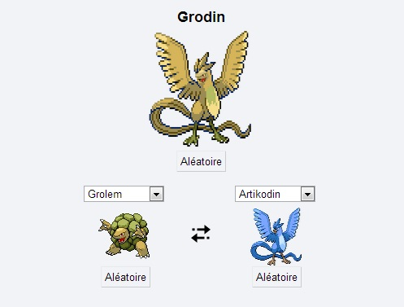

+++
title = "Découvrez de nouveaux Pokemon et mixez les !"
slug = 'decouvrez-de-nouveaux-pokemon-et-mixez-les'
aliases = ['/post/decouvrez-de-nouveaux-pokemon-et-mixez-les']
date = '2014-01-03T17:50:10.000Z'
draft = false
tags = ["pokemon","creer","mixer"]
image = 'featured.png'
+++

> Vous n'avez pas encore découvert tous les pokemons... - Professeur Chen.

Encore une création géniale du net où vous pourrez mixer les pokemons selon vos envies et ainsi créer des résultats parfois très amusants.

Je me suis amusé jusqu'à trouver un pokemon digne de rivaliser avec les plus récent : GRODIN !

Pour vous éclater vous aussi, voici le [site](http://fr.pokemon.alexonsager.net/).

L'auteur explique aussi sur [son blog](http://www.alexonsager.net/blog/2013/06/04/behind-the-scenes-pokemon-fusion/) comment il a créé cet effet, la technique reste néanmoins pas à la portée de tous.

J'espère que vous apprecierez cette petite trouvaille du net :)

_Crédit image : Unknow_
