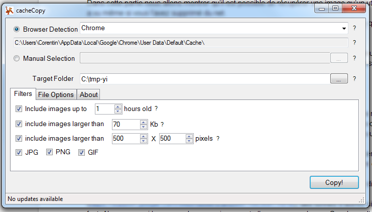

+++
title = "[DOSSIER] L’hypermnésie du web - Sécurité et Vie privée sur Internet"
slug = 'dossier-lhypermnesie-du-web-securite-et-vie-privee-sur-internet'
aliases = ['/post/dossier-lhypermnesie-du-web-securite-et-vie-privee-sur-internet']
date = '2014-11-16T13:11:17.000Z'
draft = false
tags = ["internet","vie","hypermnesie","privee","securite","web"]
image = 'featured.jpg'
+++

Aujourd’hui internet permet de faire à peu près n’importe quoi, acheter, vendre, échanger, communiquer…

Internet a pris une ampleur phénoménale dans ce dernier domaine grâce aux réseaux sociaux. Mettant en avant vos passions, votre vie privée parfois, ces énormes plateformes d’échanges sont devenues un passe temps favoris pour certains et de nombreuses données transites d’un point à l’autre de la planète.

Ici, nous allons parler d’hypermnésie, car si vous avez marqué un jour sur Facebook que vous aviez soif de Coca Cola le web lui s’en souvient.

Comment sont gérées ces données ? Et quelles traces laissent elles ?

### **Plan :**

1.  I. Vos données sur le web

1.  A. Les sites web

1.  1 - Démultiplication des données / TimeMachine ([http://archive.org/web/](http://www.google.com/url?q=http%3A%2F%2Farchive.org%2Fweb%2F&sa=D&sntz=1&usg=AFQjCNH3UTS5qYGAsNgNIzkIrf5utUZFDQ))
2.  2 - Echange (vente) de donnée / Web Analytics

2.  B. Le cache de votre navigateur web

1.  1 - C’est quoi ?
2.  2 - Récupérer des morceaux du cache (images)
3.  3 - Le cache des moteurs de recherche (Google)
4.  4 - Les sites qui stockent des données sur votre ordinateur et comment les supprimer

2.  II. La CNIL

1.  A. Les lois (en France)
2.  B. Le Rôle de La CNIL

1.  1 - Que peut-on leur demander?
2.  2 - Qu’est ce que la CNIL peut faire?

3.  C .Des Résultats ?

1.  1 - Des chiffres
2.  2 - Est ce efficace ?

# I. Vos données sur le web

## A. Les sites web :

**1\. La démultiplication des données :**

Quand vous vous inscrivez sur un site toutes vos données comme votre âge, votre anniversaire, votre sexe, vos centres d’intérêts sont enregistrées dans une base de donnée, cette base de donnée peut être récupérée notamment sur les réseaux sociaux grâce à des systèmes nommés les APIs, ainsi vous pouvez afficher votre flux twitter ainsi que votre nombre d’abonné sur votre page web.

Pour récupérer vos données les sites doivent obtenir votre accord, pourtant vos données peuvent être stockées sur plusieurs serveurs dans le monde entier (afin de garder toujours une sauvegarde au cas où).

Prenons un exemple, vous créez un blog sur la plateforme Tumblr et vous y publiez des photos de vos vacances. Vient le jour où vous souhaitez effacer ces photos qui peuvent être compromettantes pour votre futur job. Et bien sachez qu’il sera possible d’accéder à vos photos pendant longtemps et ce de diverse manière :

*   Grâce au cache du navigateur d’un des visiteurs de votre site (voir paragraphe B.2)
*   Grâce à Google et son système de cache (voir paragraphe B.3)
*   Grâce à des sites d’archives nommées les Times Machines comme par exemple[http://archive.org/web/](http://www.google.com/url?q=http%3A%2F%2Farchive.org%2Fweb%2F&sa=D&sntz=1&usg=AFQjCNH3UTS5qYGAsNgNIzkIrf5utUZFDQ) où vous pouvez accéder à des sites même peu connus à différentes dates du passé.

**2\. Vos données, des outils primordiaux pour les entreprises :**

En effet, toutes les données que peuvent récolter sur vous les entreprises via les réseaux sociaux par exemple leurs permettent de créer de réelles cartes d’identité qu’elles classeront pour connaître le sexe, l’âge, les goûts des personnes qui visitent leur site web ou sont attirés par leur produit.

Aujourd’hui, des entreprises se sont spécialisées dans ce domaine et revendent des données, vos données sur internet. C’est ainsi que l’on voit apparaître des pubs ciblées en fonction des pages que vous avez précédemment visités, voire même en fonction du temps que vous avez passé dessus.

_Exemple de données géographiques récoltées grâce à Google Analytics._

## B. Le cache de votre navigateur web :

**1\. Qu’est ce que le cache ? :**

Sans le cache votre navigateur serait le plus lent du monde. Pourquoi ? En fait quand vous visitez un site web, comme une site d’actualités, certains boutons, images, menus de navigation, background sont toujours les mêmes qu’importe la page que vous visitez. Le cache agit comme un stockage pour garder en mémoire les éléments que vous avez déjà vu sur un site et ainsi charger beaucoup plus rapidement les pages web.

NDLA : Réaliser le système de cache d’un site web c’est aujourd’hui un métier car cela demande des compétences très spécifiques pour obtenir un site optimisés, car un site long à charger peut faire fuir un potentiel client.

**2\. Récupérer le cache d’un navigateur internet :**

Dans cette partie nous allons montrer qu’il est possible de récupérer une image qu’un utilisateur a vu même si vous l’avez supprimé du net.

Pour récupérer le cache d’un navigateur on peut utiliser un logiciel nommé cacheCopy qui va extraire toutes les images contenues dans le cache de votre navigateur.

[http://cachecopy.codeplex.com/](http://www.google.com/url?q=http%3A%2F%2Fcachecopy.codeplex.com%2F&sa=D&sntz=1&usg=AFQjCNGvMl-OMfJOvEHPXpcDEdNMCYkQRw)

Pour l’utiliser il suffit de sélectionner le répertoire dans lequel le cache de votre navigateur est situé, généralement dans les AppData. Il faut ensuite choisir le dossier de destination est de filtrer les images à récupérer en fonction de l’heure, la taille, le type de fichier.

**3. Le cache des moteurs de recherche (GOOGLE):**

Google met en cache sur ses serveurs de nombreux sites afin qu’ils soient disponibles même si le serveur distant est indisponible. Le principe de cette mise en cache se rapporte plus ou moins au fonctionnement des CDN (content delivery network) sortes de serveurs qui démultiplient les données à divers points de la planète pour que la page d’un site charge plus rapidement. Une simple copie du code mis dans un serveur, à la manière des Time-Machines.

Ce service est vraiment utile mais les plus gros sites peuvent bloquer ce service sur certaines de leurs pages, comme Facebook par exemple. Impossible de trouver la page d’un ami en cache sur Google, seules les pages fan apparaissent car elles sont ouvertes à tous.

Est il possible de bloquer cette mise en cache sur un site ? Même s’il est possible par diverses méthodes de bloquer l’accès à son site aux robots de mises en cache de Google ([https://support.google.com/webmasters/answer/1663691?hl=fr](https://support.google.com/webmasters/answer/1663691?hl=fr)), des tonnes d’autres sites le font.

Alors pourquoi les pages de nos amis ne sont elles pas en cache sur Google ou d’autres sites qui proposent les mêmes services ? Et bien tout simplement parce que leurs sites sont construits en php. Quand vous allez sur facebook.com (et que vous êtes connectés), votre ami qui lui aussi sera connecté ne verra pas la même chose, tout simplement parce que la base de donnée ne lui donnera pas accès aux mêmes tables de données. 

Au final, un robot de mise en cache qui visitera Facebook ne se connectera pas sur le site et n’accédera donc pas à quelconques données. C’est aussi pour cela que vous ne pouvez pas voir les administrations des sites de news par exemple.

**4\. Les sites qui stockent des données sur votre ordinateur et comment les supprimer :**

\- Quels sites ont stocké des données sur votre pc ?

Dans cette partie nous allons vous montrer qu’il est possible de connaître les sites qui ont stocké des données, parfois malicieuses, dans votre cache.

Pour voir exactement toutes ces données et si vous utilisez Google Chrome, vous pouvez essayer d’aller dans “Paramètres”, puis paramètres avancés, “Paramètres de contenu” et enfin “Cookies et données de site”. Dans cet onglet vous pourrez voir la liste de tous les sites avec tous leurs cookies. Pour chaque cookie, vous pourrez voir son nom, son contenu, sa date d’expiration même si ces données ne vous aideront pas à comprendre leur utilité.

\- Comment effacer les données stockées sur mon pc (cookies, dns…) ?

Vous pouvez utiliser un logiciel qui effacera toutes ces données, comme Ccleaner développé par Piriform ([https://www.piriform.com/ccleaner](https://www.google.com/url?q=https%3A%2F%2Fwww.piriform.com%2Fccleaner&sa=D&sntz=1&usg=AFQjCNHkWDHMmmgaD_PDSFa485bUgUitIw)).

# II. La CNIL :

La Commission Nationale de l’Informatique et des Libertés est une autorité administrative indépendante qui a pour devoir de veiller à ce que l’informatique soit au service du citoyen et qu’elle ne porte pas atteinte aux droits de celui-ci.

## **A. Les lois (en France) :**

La CNIL se base sur la loi Informatique et libertés, cette loi définie donc un certain nombre de droits que possède l’utilisateur et qu’il doit faire valoir lui-même. Ces droit sont les suivants:

Le droit à l’information : 

Ce droit permet à l’utilisateur d’un système informatique de savoir si ses données personnelles sont collectés et/ou utilisées et de connaître les raisons de la collecte, l’identité du responsable ainsi que les hypothétiques conséquences. Néanmoins, il y a bien sur des limites, ce droit peut avoir moins d’influence si les données ont été récupérées indirectement de plus il sera refusé s’il s’agit de données en rapport avec la Police/Gendarmerie ou provenant de condamnations pénales.

Le droit d’accès : 

Il permet à une personne, déclinant son identité, d’interroger le responsable d’un fichier sur la possible possession d’informations la concernant, d’en connaître les détails, de quel manière elles vont être transmises et de les faires éventuellement corriger ou supprimer. Ce droit peut être refusé si cette demande est décrite comme abusive par le responsable des données en question, en revanche si l’affaire est portée devant un juge il devra fournir une preuve de l’“abusif”.

Le droit de rectification : 

L’erreur est humaine c’est bien connu, il paraît donc normal qu’il existe une loi permettant à toute personne de pouvoir modifier, actualiser ou encore supprimer des informations qui la concerne si celles sont inexactes. Ce droit permet aussi de verrouiller ces données si leur utilisation/collecte se révèle interdite.

Le droit d’opposition : 

Ce droit donne à l’utilisateur la possibilité de refuser que ses données soit utiliser à des fins de prospection (ex:commercial) ou encore de refuser d’apparaître dans un fichier, il faudra néanmoins une justification pour le second cas. Cela parait trop beau n’est-ce pas? En effet, ce droit est tout à fait inutile (refusé) pour des fichiers concernant le service public, judiciaire, fiscal ainsi que pour les fichiers de la Police et de la sécurité sociale entre autres…

Le droit d'accès indirect : 

Celui-ci ne concerne que des fichiers “sensibles”, on peut donner l’exemple des fichiers judiciaires, fichiers pouvant influencer la sécurité de l’État et des citoyens ou encore des fichiers bancaires. Il en effet possible de savoir si des informations nous concernant se trouve dans ces fichiers et d’avoir éventuellement quelques détails, mais cela passe par des procédures compliquées et assez longues par le biais de la CNIL.

## **B. Le rôle de la CNIL :**

C’est bien beau d’avoir des lois sur lesquelles s’appuyer mais encore faut-il pouvoir agir.

**1\. Que peut-on leur demander?**

En fait assez peu de choses, 3 pour généraliser:

*   Soumettre une plainte pour violation des droits cités plus haut.
*   Demander les coordonnées d’un responsable de fichier, ce qui permet d’exercer des droits comme celui d’accès.
*   Accéder à des informations provenant de fichiers de Police/Gendarmerie.

**2\. Qu’est-ce que la CNIL peut faire?**

Cet organisme à la possibilité d’intervenir directement auprès d’un responsable désigné, de contrôler les données personnelles que d’autres organismes exploitent, de donner des sanctions en cas de non respect de la loi et dans certain cas graves de dénoncer les protagonistes à la Justice.

Ces sanctions sont le plus souvent sous la forme d'amendes n'excédant pas les 150 000 € ce qui est assez insignifiant pour de grosses sociétés.

## **C. Des Résultats ?**

Voici quelques chiffres, tirés de Wikipédia :

La CNIL en 2012 :

*   458 contrôles ; 173 contrôles en vidéoprotection ;
*   43 mises en demeure ;
*   4 sanctions ;
*   6 017 plaintes reçues
*   3 682 demandes de droit d'accès indirect (fichiers de police et de gendarmerie)
*   140 000 appels reçus
*   10 709 organismes ont désigné un correspondant informatique et libertés

La CNIL en 2011 :

*   385 contrôles
*   65 mises en demeure
*   19 sanctions
*   5 737 plaintes reçues
*   2 099 demandes de droit d'accès indirect (fichiers de police et de gendarmerie)
*   32 743 courriers entrants numérisés
*   82 243 déclarations
*   11 600 appels/mois

On notera que le nombre de sanctions est très faible par rapport aux nombres de plaintes reçues. On peut expliquer cette situation par le fait que la CNIL a une portée limitée dans le monde et que de nombreuses données sont stockées hors de l’Union Européenne.

De plus, les sanctions endossées par ceux qui transgressent la loi sont souvent bien insuffisantes.

Dernièrement, Google s’est vu condamné par la CNIL pour la somme de 150 000 euros. La CNIL avait déjà mis en garde Google en juin dernier. L’organisme exigeait que Google s’adapte aux lois françaises de la confidentialité des informations. Suite à un changement de sa politique en mars 2013, Google a en effet accès à un certain nombre d’informations sur la vie privée de ses utilisateurs comme les localisations géographiques, les numéro de téléphone, les adresses postales, etc.).

Le total à verser est de 150 000 euros, maximum autorisé en France. Or, cette somme est totalement dérisoire pour une firme de cette taille et ne permettra pas de faire changer les méthodes de Google.

Autrement dis, La CNIL a une influence assez médiocre et ne possède pas de réel moyen de pression pour faire respecter les droits des citoyens.

## **CONCLUSION :**

Beaucoup de sites web stockent des données à la fois sur leurs serveurs et sur votre propre ordinateur. De plus, vos données peuvent être recoupées et créer une véritable fiche d’identité utilisateur.

L'imprégnation de vos données est d’autant plus forte que la viralité des réseaux sociaux permet de partager une donnée à travers le monde instantanément.

Cependant vos données vous appartiennent et ça, les organismes publiques en France l’ont bien compris. Pourtant leur action reste de faible portée face à l’hypermnésie du web et à la surpuissance des grandes entreprises.

****

**Pourrons-nous un jour protéger nos données totalement ?**

Notre Réponse : Cette question ressemble étrangement à d’autres tel que: Pourront-nous un jour arrêter la faim dans le monde? La guerre s’arrêtera-t-elle finalement? Vivront-nous dans un monde parfait?

Cette protection totale des données ressemble plutôt à une utopie qu’à quelque chose de réalisable.

_Dossier réalisé avec Julien Tison, les erreurs pouvant se trouver dans ce dossier sont fortuites. Merci de les signaler dans les commentaires._
