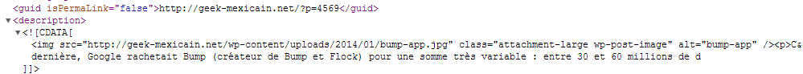

+++
title = "Image à la une dans le RSS - Wordpress"
slug = 'image-a-la-une-dans-le-rss-wordpress'
aliases = ['/post/image-a-la-une-dans-le-rss-wordpress']
date = '2014-01-03T09:32:58.000Z'
draft = false
tags = ["wordpress","plugin","rss"]
image = 'featured.jpg'
+++

**Dans ce tutoriel Wordpress, je vais vous montrer comment ajouter l'image à la une ou "featured image" dans votre rss.**

Pour ce faire, il suffit d'utiliser un plugin nommé Featured Image In RSS Feed ([lien](http://wordpress.org/plugins/featured-image-in-rss-feed/)) qui va tout simplement ajouter l'image en haut de votre flux rss pour chaque article.

Il est aussi possible de modifier la taille de l'image à la une pour le rss, dans les paramètres. Et voici le résultat :

C'est tout !
