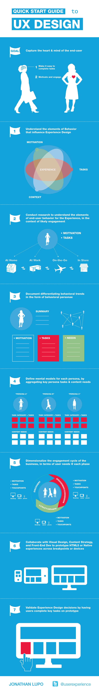

+++
title = "[Infographie] Guide rapide du designer UX"
slug = 'infographie-guide-rapide-du-designer-ux'
aliases = ['/post/infographie-guide-rapide-du-designer-ux']
date = '2014-01-03T20:36:56.000Z'
draft = false
tags = ["design","ux","guide","infographie"]
image = 'featured.jpg'
+++

**Le design d'expérience utilisateur est un travail exceptionnel qui demande de conprendre ce qu'aime les gens.**

C'est pourquoi je vous propose une infographie réalisée par [Jonathan Lupo](http://visual.ly/quick-start-guide-ux-design) qui vous expliquera ses solutions pour réaliser des designs de qualité.

