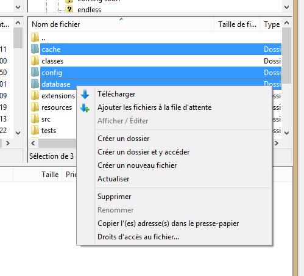
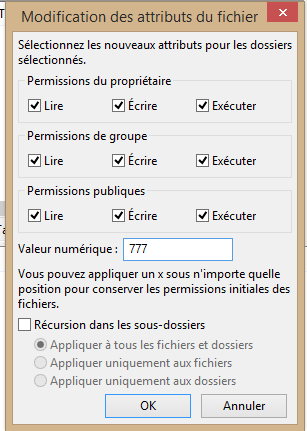

+++
title = "Installer Bolt CMS via FTP"
slug = 'installer-bolt-cms-via-ftp'
aliases = ['/post/installer-bolt-cms-via-ftp']
date = '2014-09-15T07:02:54.000Z'
draft = false
tags = ["installer","cms","bolt","html5","css","php"]
image = 'featured.jpg'
+++

Dans un précédent article, je vous expliquez mon choix du cms Bolt. Je vais donc vous proposer une série de tutoriel pour l'utiliser.

Cette installation se fera de la manière la plus courante, par FTP.

1 - Tout d'abord, vous devez vous munir d'un logiciel client FTP tel que [Filezilla](http://filezilla.fr/). Connectez vous à votre serveur et placez vous dans le dossier dans lequel vous voulez intsaller Bolt.

2 - Téléchargez la dernière version de Bolt à [cette adresse](http://bolt.cm/distribution/bolt_latest.zip). Placez ensuite le contenu de l'archive sur votre serveur.

3 - Il faut modifier les permissions de certains dossier afin que Bolt puisse les lire et les modifier. Pour cela, il vous faut changer le chmod à **777** des dossiers ci-dessous.

*   app/cache/
*   app/config/
*   app/database/
*   files/
*   theme/

4 - Voilà Bolt est installé, il ne reste plus qu'à le configurer...

**Note** : N'oubliez pas d'uploader le fichier .htaccess présent dans l'archive. Si vous ne le voyez pas dans l'archive ou une fois cette dernière extraite, vous pouvez le télécharger [ici](http://bolt.cm/distribution/default.htaccess). Uploadez le et renommez le .htaccess .
