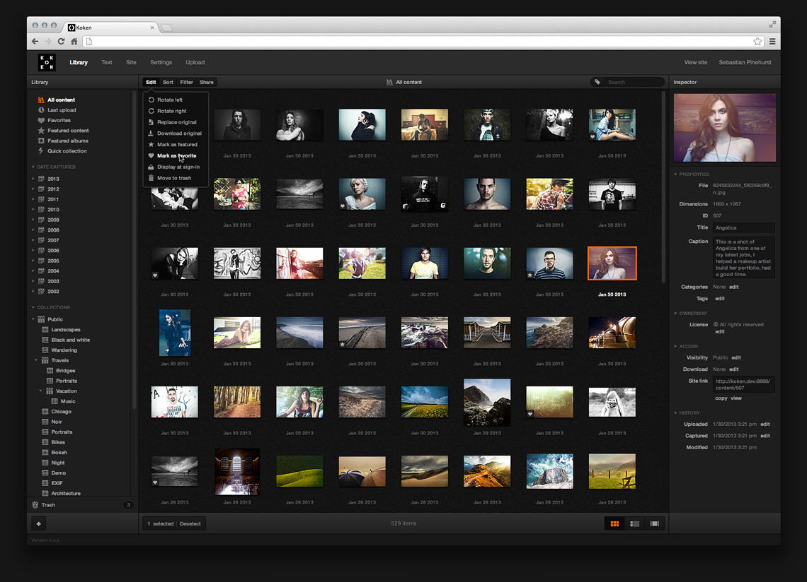

+++
title = "Koken : un CMS pour créer un superbe portfolio"
slug = 'koken-un-cms-pour-creer-un-superbe-portfolio'
aliases = ['/post/koken-un-cms-pour-creer-un-superbe-portfolio']
date = '2014-04-15T18:47:38.000Z'
draft = false
tags = ["koken","blog","cms","source","free"]
image = 'featured.jpg'
+++

Il existe beaucoup de CMS sur le net mais peu dédié aux portofolios et à la photographie en général.

J'ai découvert il y a quelques temps : Koken, c'est cms entièrement dédié à ce sujet avec une superbe interface et tout plein de fonctionalités géniales.

Vous pouvez facilement uploader vos images depuis votre ordinateur ou via la syncronisation avec LightRoom d'Adobe, puis vous pourrez éditer vos photos. L'interface de rédaction  est de type WYSIWYG, vous modifier directement votre page (ce que vous voyez c'est ce que vous obtiendrez) sans aucune ligne de code. Vous pouvez ajouter toute sorte de contenu venu de Twitter, Flickr, SoundCloud...

Vous pourrez aussi facilement créer votre propre thème si vous developpez un peu car les thèmes proposés sont assez chers (60$).

Le CMS est disponible gratuitement [ici](http://koken.me/).
