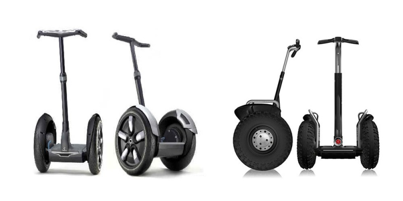
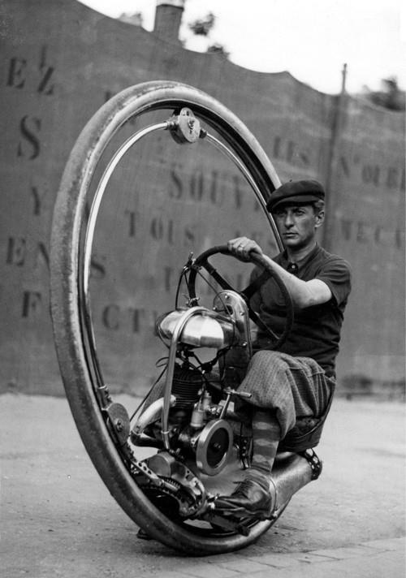

+++
title = "OneWheel un skateboard mono roue"
slug = 'onewheel-un-skateboard-mono-roue'
aliases = ['/post/onewheel-un-skateboard-mono-roue']
date = '2014-01-22T18:28:38.000Z'
draft = false
tags = ["onewheel","invention"]
image = 'featured.jpg'
+++

Niveau skateboard originaux vous connaissez surement le Wave Board (ou "Oxelo board"), skate a deux roues qui ressemble a du surf sur roues.

Mais voici venir un nouveau prototype développé avec le soutien crowdfunding sur KickStarter, nommé OneWheel. Il s'agite d'un skateboard électrique qui à la particularité de n'avoir qu"une seule roue.

Le projet Kyle Doerkson a été présenté dernièrement lors du CES 2014 à Los Angeles. Voici une vidéo pour vous montrer le potentiel d'un telle machine :

<iframe width="100%" height="360" src="//www.youtube.com/embed/ns7RFZPTfpc" frameborder="0" allowfullscreen=""></iframe>

On pourra noter l'inspiration du à l'**Hoverboard** issu de "Retour vers le futur". L'autonomie d'un tel engin est de 6 à 10 km, ce qui semble relativement acceptable. De plus, l'objectif Kickstarter de 100 000 dollars a largement était atteint puisque bientôt triplé.

### La question est "Comment ça fonctionne ?"

Je vous propose une partie de la réponse. En fait le système à l'intérieur du OneWheel s'apparente à celui d'un véhicule que l'on connait assez bien maintenant : **le SegWay**.

En effet, le SegWay dispose d'accéléromètres et de gyroscopes qui lui permettent de connnaitre dans quel sens/direction penche l'appareil. De ce fait en se penchant vers l'avant on créé alors **un stade d'instabilité**. La machine va alors tenter de le résoudre et va faire tourner la roue pour rétablir l'équilibre. C'est donc en se penchant que l'on force le skateboard à avancer, le principe est le même lorsque l'on se penche en 

arrière.

On a déjà eu droit à ce type d'engin dans la fiction comme par exemple cette monowheel qui semble tout à fait authetique :

Ou bien la fameuse **Tsmeu-6 du général Grievous** dans l'épisode III de Star Wars :

<iframe width="100%" height="360" src="//www.youtube.com/embed/YY84jx5Iux8" frameborder="0" allowfullscreen=""></iframe>

_Si vous êtes intéressé par les autres engins fantastiques à roues, je vous conseille [ce merveilleux article](http://culturevisuelle.org/dejavu/1377)._

N'hésitez pas à commenter :-)
