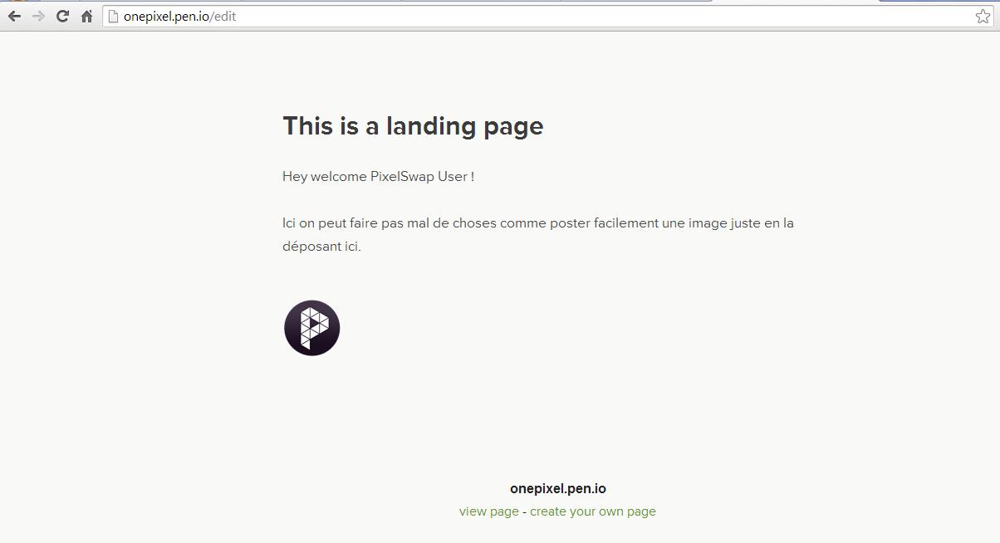

+++
title = "Pen.io : Créer une page web rapidement !"
slug = 'penio-creer-une-page-web-rapidement'
aliases = ['/post/penio-creer-une-page-web-rapidement']
date = '2014-04-15T19:03:07.000Z'
draft = false
tags = ["website","pen-io","web","creer"]
image = 'featured.png'
+++

Beaucoup de solutions permettent d'écrire des articles sur le net mais [Pen.io](http://pen.io) est de loin le plus rapide.

En effet, il vous suffit de choisir une adresse pour votre page _name_.pen.io, de mettre un mot de passe et c'est parti. Vous avez juste à cliquer sur le titre ou le contenu pour éditer. Pour poster une image il suffit de la faire glisser sur la fenêtre. 

Et voilà cliquez sur "Save" et votre page / article est directement en ligne.

L'avantage c'est aussi qu'ils n'enregistrent pas votre adresse mail :-) et vous trouverez [ici](http://youcanusepento.pen.io/) la liste de tout ce que vous pourrez faire avec.

