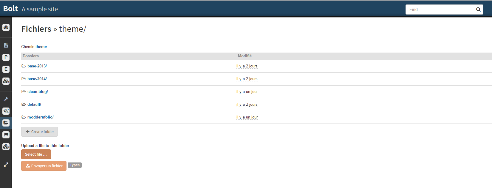
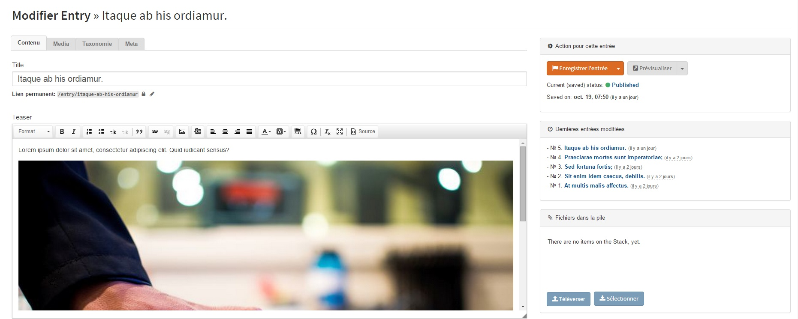

+++
title = "Quelques images du nouveau backend de Bolt 2.0"
slug = 'quelques-images-du-nouveau-backend-de-bolt-20'
aliases = ['/post/quelques-images-du-nouveau-backend-de-bolt-20']
date = '2014-10-20T19:05:07.000Z'
draft = false
tags = ["administration","backend","bolt","design","html5","css"]
image = 'featured.png'
+++

Je vous ai parlé dans un [précédent post](/entry/retrospective-boltcamp-2-bolt-cms) de la sortie de la beta du nouveau Bolt à l'issue du Boltcamp.

La version "Bolt Camp" est téléchargeable sur la [page des distributions](http://bolt.cm/distribution/) de Bolt.

Je vais donc vous parler un peu plus du nouveau design de l'administration. Comme vous pouvez le voir ci-dessus, celle-ci a été rafraichie, beaucoup plus tendance.

En effet, le choix a été fait pour un design plus _flat_ avec l'utilisation de [Bootstrap 3](http://getbootstrap.com/). Nous avons aussi opté pour un menu vertical qui offre une meilleure lisibilité et accessibilité.

Ce menu vertical peut aussi se retracter afin d'accéder à un plus grand espace de travail. Comme vous pouvez le voir ci-dessous un grand soin a été apporté aux couleurs utilisées, respecter la chartre graphique de Bolt tout en épurant les éléments graphiques inutiles de la précédente version.

L'édition des contenus a été repensée pour une meilleure ergonomie. En effet, les champs (fields) ont été retravaillés et catégorisés en 4 groupes : "Contenu", "Media", "Taxonomie" et "Meta".

Plus besoin de scroller pour écrire un article ! Tout est à portée de clic.

C'est tout pour cette présentation du nouveau design de Bolt, je vous donne rendez vous dans quelques jours pour une vidéo de présentation de cette interface utilisateur !

_Take care ! And have fun ;-)_
