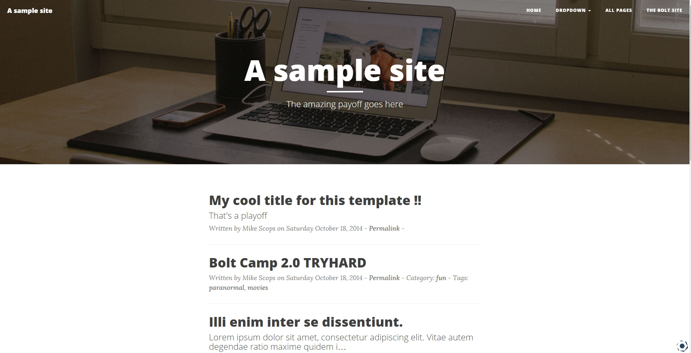

+++
title = "Rétrospective Boltcamp 2 | Bolt CMS"
slug = 'retrospective-boltcamp-2-bolt-cms'
aliases = ['/post/retrospective-boltcamp-2-bolt-cms']
date = '2014-10-19T20:08:52.000Z'
draft = false
tags = ["boltcamp","meeting","irc","bolt","web","design"]
image = 'featured.jpg'
+++

Ce weekend a eu lieu la deuxième édition du Boltcamp rassemblant les développeurs du CMS Bolt autour de bonnes bières mais aussi d'un objectif commun : la réalisation de la version 2.0.

N'ayant pas pu me rendre sur l'île de Vlieland aux Pays Bas, j'ai participé à cette réunion grâce à l'IRC déployé pour l'occasion. J'ai pu travaillé sur différents points de la nouvelle mouture du CMS comme la gestion des extensions, le traductions, et le developpement de thèmes.

Ce Boltcamp a aussi été l'occasion de faire de chouettes rencontres. C'est pourquoi je souhaite remercier Thais Santos qui a été une excellente élève durant ce weekend, j'ai pu la coacher sur les bases du templating en twig. C'est une première expérience en temps que prof sur Bolt et j'ai été ravi de pouvoir partager les connaissances que j'ai acquéri depuis que j'ai rejoins le projet, soit depuis plus d'un an. Encore une fois je remercie Bob Den Otter pour avoir été mon mentor tout ce temps là. Maintenant c'est mon tour ;-)

Je remercie aussi Gawain Lynch pour avoir codé ce bot sur l'IRC qui nous a tant amusé #pr #beer #karma #love ! Sans oublier toutes les bonnes recontres comme Seraf, GDmac et puis tous ceux auxquels je ne pense plus là.

Un nouveau thème pour Bolt nommé [Clean Blog](http://extensions.bolt.cm/view/4db383c5-56da-11e4-866c-43d66b93a270) :

Des [nombreux correctifs](https://github.com/Mikescops) pour mes précédents thèmes. Des correctifs pour les outputs de Ckeditor, la traductions françaises améliorées, une chasse aux bugs...

Et finalement on a dévoilé la nouvelle beta de Bolt ! C'est par [ici](https://bolt.cm/newsitem/bolt-20-beta-released).

_For my dear english mates..._

This weekend, the second Boltcamp took place in Vlieland in the Netherland, and unfortunately I could not come, again... But an IRC was deplaoyed so I could work with them. So, I worked on a boatload of things during this week just like extensions, issues tracking, translations and web design.

This Boltcamp was also time for great meetings (someone say beers ?). Firstly, I must thanks my really good student Thais Santos who did a great job ! I could coached her on the bases of twig templating. We did a good work (look at the website screenshot above). That was my first time as a teacher on Bolt. Must thanks Bob Den Otter for being my mentor from the beginning when I joined the project. Now it's my turn !

Big up to Gawain Lynch who code this awesome bot on the IRC, that was really funny #pr #beer #karma #love ! And I met some incredible guys like Seraf, GDmac and many others I forget.

_Hope that next time I'll be able to join the third Boltcamp physically !_

_#beer_
