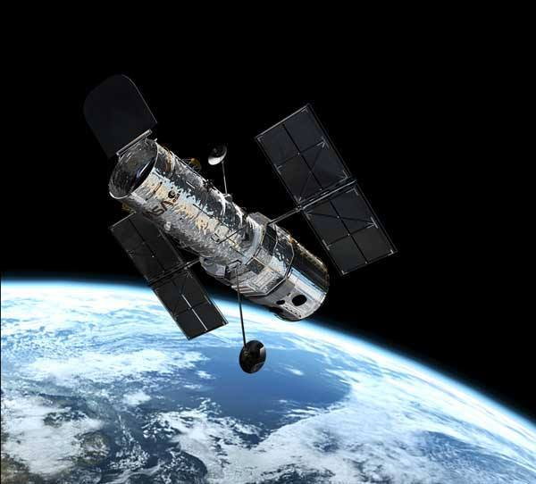

+++
title = "Tout Savoir : des connaissances qui font la différence"
slug = 'tout-savoir-des-connaissances-qui-font-la-difference'
aliases = ['/post/tout-savoir-des-connaissances-qui-font-la-difference']
date = '2014-01-26T13:11:53.000Z'
draft = false
tags = ["savoir","connaissance","pratique"]
image = 'featured.jpg'
+++

J'ai découvert il y a peu une superbe [page Facebook](https://www.facebook.com/Toutsavoirinfoculture) nommée "Tout Savoir" qui vous propose quelques notions pour votre culture générale.

Au-delà du fait d'être mené par une superbe équipe de modérateurs vous apprendrez plein de choses **nouvelles et originales**, et ça c'est cool !

Voici un exemple d'articles que vous trouverez :

> Le télescope spatial Hubble a détecté des traces d'eau dans l'atmosphère de cinq planètes situées au-delà de notre système solaire, révèle une étude publiée le 3 décembre 2013 dans la revue The Astrophysical Journal.
> 
>   
> Baptisées WASP-17b, HD209458b, WASP-12b, WASP-19b and XO-1b, ces cinq planètes ont une taille analogue à celle de Jupiter, et présentent toutes une température extrêmement élevée en raison de la faible distance qui les sépare de leur étoile. En conséquence, elles ne sont pas à même d'abriter la vie.  
>   
> Cette découverte a été effectuée grâce à l'instrument Wide Field Camera 3, un capteur très puissant embarqué à bord du télescope spatial Hubble : lorsque la planète analysée par Hubble passe devant l'étoile autour de laquelle elle orbite, la lumière émise par l'étoile s'en trouve modifiée, et cette modification est détectée par l'instrument Wide Field Camera 3. L’analyse de ces modifications apporte alors de nombreuses informations sur la composition chimique de l'atmosphère de la planète.  
>   
> (Dédée)
> 
> 

En somme une belle page grâce à laquelle vous pourrez **briller en société** !
