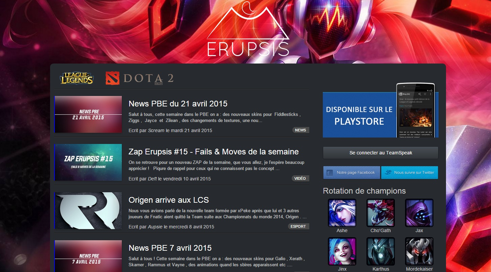

+++
title = "Erupsis.com : une expérience, une aventure, une fin"
slug = 'erupsiscom-une-experience-une-aventure-une-fin'
aliases = ['/post/erupsiscom-une-experience-une-aventure-une-fin']
date = '2015-06-27T09:58:09.000Z'
draft = false
tags = ["web","erupsis","administration"]
image = 'featured.jpg'
+++

Il y a plus d'un an maintenant, en janvier 2014, j'ai conçu un site d'actulité sur l'e-sport et plus particulièrement League of Legends et DotA2. A la fois, une source d'actualité, une base de donnée répertoriant les divers héros des jeux, et une communauté, Erupsis était un projet ambitieux. Peut être trop...

Il y a maintenant 2 mois, j'ai décidé d'arrêter ce projet. De nombreux rédacteurs, on écrit pour le site, mais chacun avait des disponibilités variables et puis la motivation retombe rapidement. De fait, le site était en concurrence direct avec des structures disposant de moyens bien plus conséquents. Manque de temps, de personnes et d'idées pour encore améliorer le site, j'ai choisi de conserver ce qui avait été créé puisque c'est un travail de longue haleine qui m'a pris de trop nombreuses heures.

C'est une expérience vraiment intéressante que j'ai eu avec Erupsis, contrairement à Geek Mexicain, j'ai dû gérer une équipe de 10 personnes disposant de sépcialités différentes. J'ai aussi dû réfléchir à des concepts nouveaux comme les Zap d'Erupsis publiés toutes les semaines sur Youtube.

En terme de programmation, j'ai beaucoup appris à la fois pour le deisgn que j'ai uniformisé en fonction des différentes parties du site, pour les fonctionnalités comme la section commentaires liée au forum, et pour l'administration ou plutôt le backend qui se devait d'être le plus pratique possible pour les rédacteurs et les steameurs.

J'ai été ravi de partager ce projet avec toutes les personnes qui y ont participé. 

Peut être un rework du site un jour !
