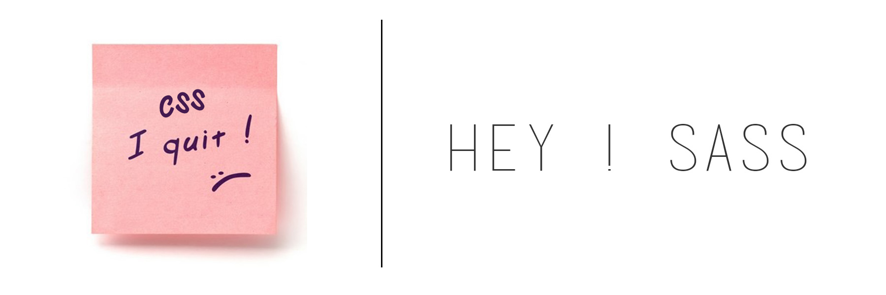

+++
title = "Intern Web Developer at Two Kings"
slug = 'intern-web-developer-at-two-kings'
aliases = ['/post/intern-web-developer-at-two-kings']
date = '2015-08-05T18:43:26.000Z'
draft = false
tags = ["twokings","development","work","bolt"]
image = 'featured.jpg'
+++

To conclude my first year of engineering school, I had to do an internship for a month. Maybe you know my involvement in Bolt CMS, but if not I'm doing some stuff for the Bolt's community and then I meet Bopp. Bopp is the owner of [Two Kings](http://twokings.nl/), a web development enterprise in Neitherland.

That's why I decided to join him for a month in The Hague. Now, it's been 3 days I'm working at 2K and I'm happy to see that this internship will **fit with my needs**.

I wanna learn how to **correctly create** a website by going through sketches and wireframes to the final live website, how **enhance** my way of coding by using the **right tools** and having a **clean code**.

Lot of things are new to me. Bye bye **manual CSS**, Welcome **SASS**.

**Command lines** are now my new friends and that's pretty worth it !

Actualy, I'm working on a **showcase part** for the [Bolt.cm](https://bolt.cm/) wich will be displaying some interesting **websites created with Bolt**. This project will take me about one week and then i'll show you here how is it looking.

If you wanna talk with me, I'm up during the day on **the IRC**, you can find [the address on this link](https://bolt.cm/community).

### **\> git pull**
