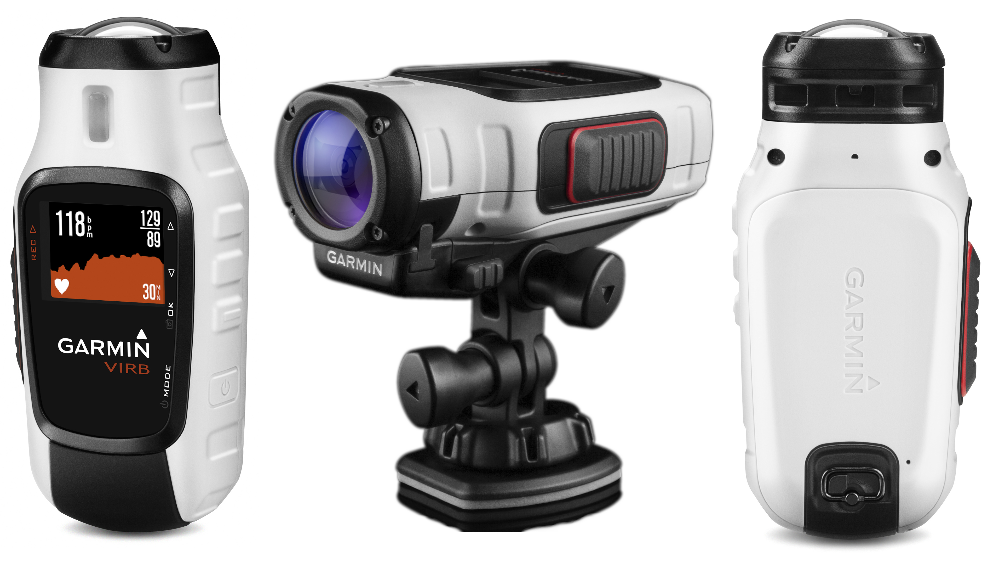
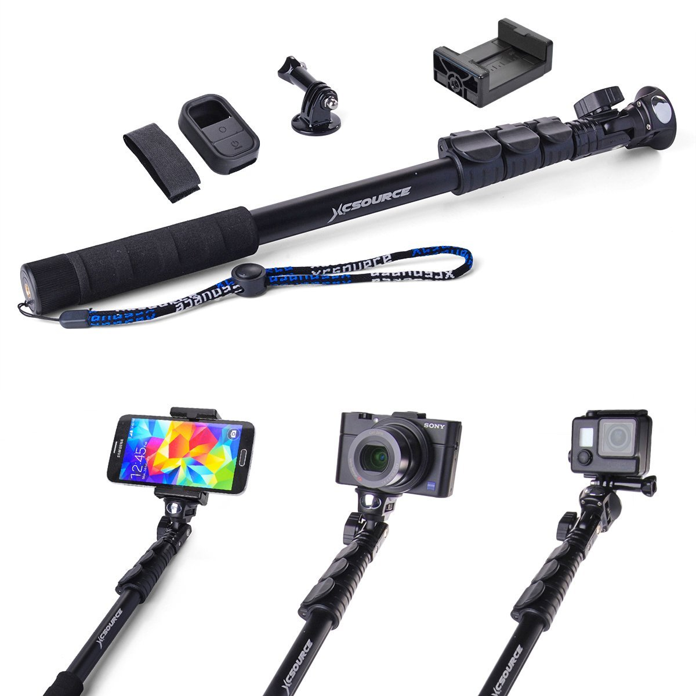
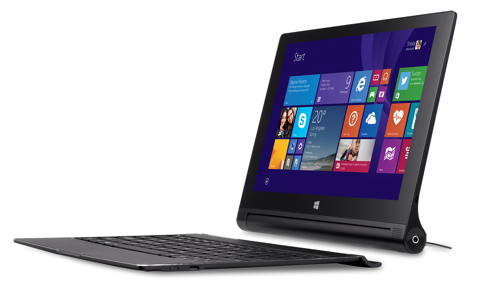
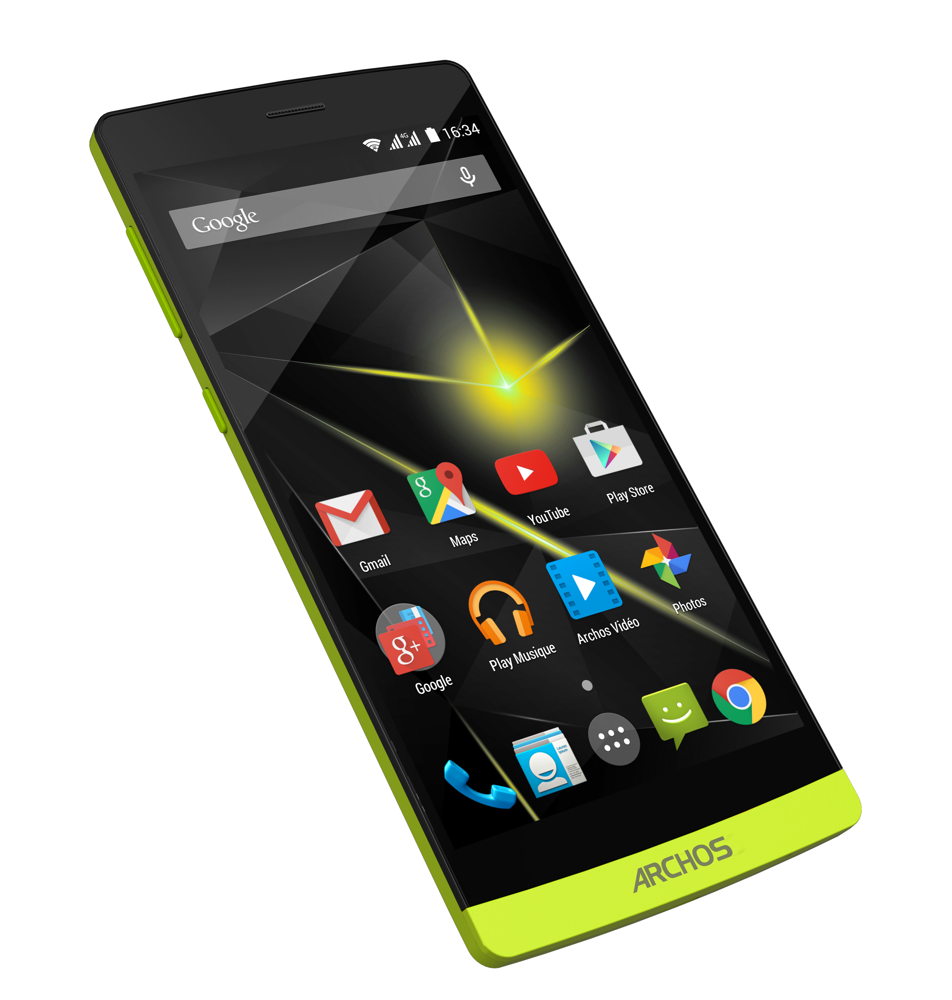

+++
title = "Set-Up pour les vacances : direction le sud"
slug = 'set-up-pour-les-vacances-direction-le-sud'
aliases = ['/post/set-up-pour-les-vacances-direction-le-sud']
date = '2015-07-09T07:59:56.000Z'
draft = false
tags = ["set-up","vacances","high-tech"]
image = 'featured.jpg'
+++

Départ dans le sud imminent pour (re)découvrir l'île de Porquerolles et ses alentours.

C'est un peu à l'écart de la ligne éditoriale de ce site mais je tenais à vous présenter quelques accessoires que j'utilise quand je pars en vacances. Principalement pour garder des souvenirs de ces vacances mais aussi rester connecté sans être encombré.

Je n'ai volontairement pas mis le nom des produits pour que vous cherchiez un peu ce que c'est. N'hésitez pas à partager vous aussi votre set-up dans les commentaires :)
