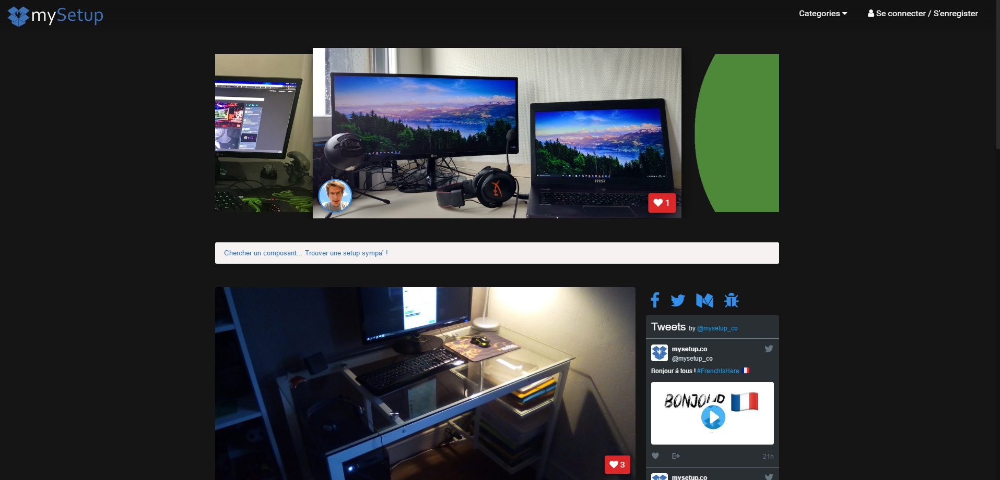

+++
title = "Création : mySetup.co le site de partage de setup"
slug = 'creation-mysetupco-le-site-de-partage-de-setup'
aliases = ['/post/creation-mysetupco-le-site-de-partage-de-setup']
date = '2017-05-08T10:27:04.000Z'
draft = false
tags = ["setup","projet","partage","mysetupco","development","design"]
image = 'featured.png'
+++

Cette création originale nommée [mySetup.co](https://mysetup.co) est un projet que j'ai mené avec la précieuse aide de [Samuel Forestier](https://horlogeskynet.github.io) dans le but de proposer une plateforme de partage de configuration d'ordinateur, de photographie ou encore de musique.

Le slogan en anglais : "Share your own setup !" résume bien cette idée.

### **Pourquoi cette idée ?**

Le constat est simple, nombreux sont ceux qui sur les discussions Twitch, Discord ... demandent la configuration, le plus souvent PC, du streamer ou youtuber qu'ils regardent. Pour répondre à cette demande et faciliter la tâche de ces derniers, j'ai eu l'idée de proposer une plateforme où ils pourraient créer une page simplement et intuitivement avec leur setup.

### **Le choix du design**

Je me suis très rapidement orienté vers un design sombre avec un fond noir pour l'ensemble du site. C'est un choix audacieux, puisque les sites ternes sont bien plus difficiles à mettre en valeur et à aérer, mais ils ont l'avantage de donner un côté premium au contenu. De plus, m'adressant en premier lieu à une communauté de gamers, ceux-ci s'identifieront facilement au jeu de couleurs choisi.

Voici un aperçu du site à l'heure où j'écris ces lignes, mais vous pouvez visiter la version en ligne sur [mysetup.co](http://mysetup.co) : 

### **Quand au back, c'est du CakePHP**

Déjà familiers avec ce framework PHP depuis les [Nuits de l'Info](/entry/recap-la-nuit-de-linfo-2015), ce choix était pour Samuel et moi une évidence. Il propose un modèle classique MVC, qui permet une grande souplesse dans le développement de la plateforme et nous permet une mise à niveau simple et régulière.

Nous avons longuement travaillé sur la sécurité de ce site, en proposant des restrictions à la fois pour les utilisateurs et les visiteurs mais aussi des mesures visant à protéger les données de chacun.

Ce projet a été l'un des défis les plus intéressant que j'ai eu à mener, de la conception de l'idée à sa réalisation. Il m'a permis d'appréhender beaucoup de notions que je ne maîtrisais pas pleinement aussi bien en terme d'administration système qu'en développement orienté-objet.

Le développement est loin d'être fini, de nouvelles idées se rajoutent au fur et à mesure et permettront d'agrémenter cette base. La partie plus "marketing" commence maintenant et c'est un défi nouveau, bien différent, qu'il faut donc relever.
