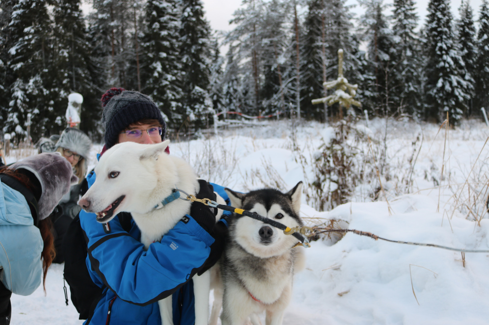

+++
title = "Billet d'humeur : Juillet 2018"
slug = 'billet-d-humeur-juillet-2018'
aliases = ['/post/billet-d-humeur-juillet-2018']
date = '2018-07-04T15:42:06.000Z'
draft = false
tags = ["life","portfolio","development","corentin"]
image = 'featured.jpg'
+++

_Article extraordinaire sur ce blog, il me semblait important de revenir sur cette 20ème année qui s'est achevée en ce début de mois dans un billet d'humeur._

Mon départ en Estonie pendant 4 mois fut le point de départ de cette année. J'ai suivi un semestre d'étude à l'université de technologies de Tallinn avec des matières assez variées allant de la robotique au management de sécurité. Cette expérience est assez unique, et je ne peux que recommander à ceux qui hésitent de se lancer dans cette aventure qui est enrichissante sur divers plans : humain, culturel et personnel.

De fait, ce n'est pas seulement des études, c'est aussi des rencontres, des voyages... J'ai eu l'occasion de découvrir l'Estonie et sa culture, ainsi que la Finlande et ses paysages uniques. Mention spéciale pour la Laponie qui a été le meilleur voyage que j'ai pu réaliser...

_Les Husky, un grand moment_

L'Estonie m'a permis aussi de faire évoluer différents projets qui me tiennent à cœur :

*   **mySetup.co** : la reprise de ce site, mis de côté pendant l'été, a abouti sur une v2 incroyable avec l'aide de [Samuel](https://blog.samuel.domains/) et à la réalisation d'une extension Twitch dédiée. Je vous invite à lire [mon précédent article sur ce sujet](/entry/mysetup-co-quelques-mots-sur-l-avancement-du-projet) pour en savoir plus.
*   **Geek Mexicain** : il était grand temps ! Adieu Wordpress, bienvenu à Bolt et au respect de la vie privée de nos utilisateurs. J'ai passé de nombreuses heures pour réaliser un design dans les tendances actuelles et épuré afin de mettre enfin le contenu en avant et correspondre à l'évolution de notre ligne éditoriale. Samuel a encore une fois contribué à la gestion du serveur derrière tout ça et je vous conseille de [lire sa note](https://blog.samuel.domains/blog/articles/geek-mexicain-frow-what-we-had-to-what-we-want) concernant les nouveautés qu'il a apporté.
*   **GTA RP Phone** : un téléphone sur un serveur GTA. Projet proposé par un ami développant un serveur multijoueur sur la célèbre licence du studio Rockstar Games. Le but était proposer une simulation d'un iPhone permettant aux utilisateurs de communiquer et d'utiliser des applications à l'intérieur du jeu.

Le début d'année 2019 a quant à lui été plus orienté sur le suivi du développement de mySetup.co afin que le projet soit le plus stable possible. Parallèlement, je me suis beaucoup intéressé à la déGAFAMisation, notamment en ouvrant mon propre cloud sous Nextcloud et l'abandon peu à peu de nombreux services de Google et consorts. Vous trouverez d'ailleurs quelques articles très inspirant dans la [section cybersécurité](https://geek-mexicain.net/categories/securite) de Geek Mexicain.

Depuis avril, je suis maintenant stagiaire dans la société ON-X, un cabinet en cybersécurité. Je travaille sur des projets internes qui me permettent de faire évoluer grandement mes compétences en développement et gestion de projet, sans oublier la composante sécurité. Cette expérience est formatrice et éclaircit mon parcours professionnel.

J'ai dernièrement pris le temps de revoir et améliorer mes sites dédiés à mon portfolio : [dev.pixelswap.fr](https://dev.pixelswap.fr/) et à mon profil professionnel : [me.pixelswap.fr](me.pixelswap.fr/).

Voilà, en quelques mots, une rétrospective de cette année mouvementée pour mes projets et mon parcours pro.
