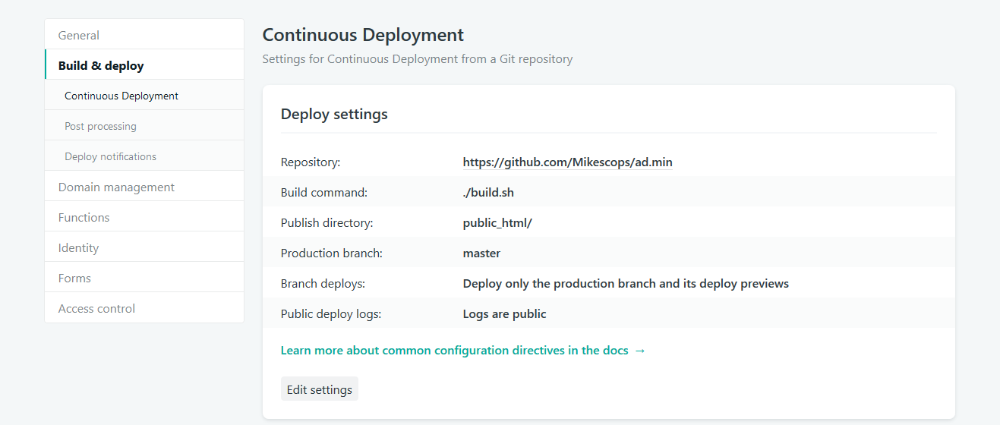

+++
title = "Deploy PHP websites as static on Netlify"
slug = 'deploy-php-websites-as-static-on-netlify'
aliases = ['/post/deploy-php-websites-as-static-on-netlify']
date = '2018-09-19T16:11:39.000Z'
draft = false
tags = ["netlify","bash","script","dev","development","php","web"]
image = 'featured.jpg'
+++

Netlify is an awesome service that lets you do continuous integration using git. Each time you push commits, the service gets the changes and rebuild your website.

The main issue is that it does not support PHP files, that's why i decided to work on a process to convert PHP website into a static website.

## Convert PHP files with a few lines

The following code will help you convert your .php files and copy your assets in the destination folder. Modify variables to fit your project, place the script in the root of your project and don't forget that PHP functions will not work here, for example when it comes to have user sessions.

```bash
#!/bin/bash

# Build script for serving static content instead of php files
DEST="./public_html"
html=".html"

# Create destination folder
mkdir -p "$DEST/"

# Execute all php files and save them as html
for f in *.php; 
do
    php $f | sed 's:\(<a.*href=".*\)\.php\(".*</a>\):\1\.html\2:g' > "$DEST/${f/.php/$html}";
    echo "Processing $f into ${f/.php/$html}..";
done


#Copy all CSS files
for f in *.css; 
do
    cat $f > "$DEST/$f";
    echo "Processing $f file..";
done


#Copy all JS files
for f in *.js; 
do
    cat $f > "$DEST/$f";
    echo "Processing $f file..";
done

echo "Process complete." ;
```

Don't forget to test your script locally and when it works well, move to the next part.

## Launching the bash script on build

Open the settings panel of your project over Netlify and click on "Build & deploy" on the lateral menu. Edit the deploy settings by adding your _build-script.sh_ as the build command and the previous set destination folder as the publish directory.



## A small example

I recently made an administration template called [ad.min](https://github.com/Mikescops/ad.min). I chose to use PHP in order to include redundant parts of the template like header and footer.

As you can see the conversion to HTML is really simple and useful here so that anyone can get a simple preview without having PHP running.

Source : [Flakus.co](https://falkus.co/2018/02/php-for-static-websites-on-netlify/)
