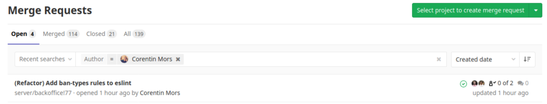
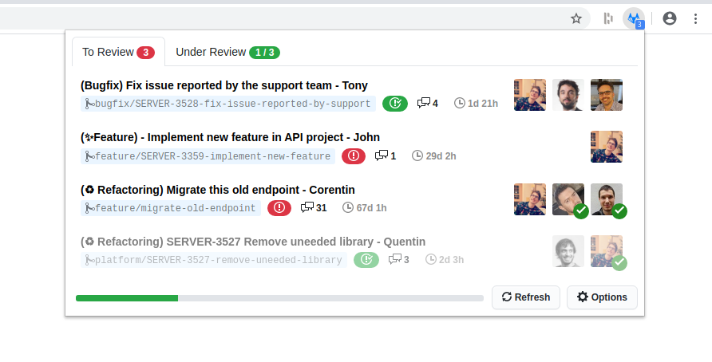

+++
title = "Création: GitLab Notify, une extension pour améliorer le flow de review"
slug = 'creation-gitlab-notify-une-extension-pour-ameliorer-le-flow-de-review'
aliases = ['/post/creation-gitlab-notify-une-extension-pour-ameliorer-le-flow-de-review']
date = '2020-05-11T13:22:42.000Z'
draft = false
tags = ["extension","firefox","chrome","gitlab","git","web"]
image = 'featured.jpg'
+++

Chez Dashlane, nous utilisons **GitLab** pour gérer les répertoires git de nos projets. L'outil est puissant, dispose de CI que je trouve absolument géniales et est une bonne solution auto-hébergée. Néanmoins, en terme d'UX il y a plusieurs points qui dans une utilisation quotidienne deviennent gênants. Voici quelques exemples:

*   Le compteur dans la barre de menu  affiche le nombre de _merge requests_ auxquelles on est assigné mais si tout a déjà été _review_ le nombre reste inchangé.
*   Sur la page des _merge requests_, on peut voir celles auxquelles on est assigné mais pas celles que l'on a créé.
*   La liste des _merge requests_ manque de détails, il n'est pas possible de voir qui a déjà approuvé une MR que l'on a créé.
*   Quand GitLab est fermé, impossible d'être alerté des nouvelles _merge requests_.
*   Le système de notifications par email est difficilement configurable, soit trop de notifications, soit pas assez.

Au final, le problème majeur qui découle de ces soucis d'UX est que les _reviews_ prennent du temps car elles sont difficilement visibles. Agacé d'avoir une énième PR (Pull Request) en attente depuis une semaine, je décide à réfléchir à une solution pour résoudre ce problème.  
  
Dans l'entreprise certains ont créé un **bot Slack** qui à 10h chaque jour annonce dans un salon les PR à relire en taggant chaque personne assignée. Problème d'un bot de ce type, une fois par jour c'est pas assez quand on a beaucoup de personnes dans une équipe, tagger des personnes demande d'hardcoder leur IDs dans le code et finalement cette solution ne convient pas à tout le monde parce que ça fait un peu "spam".  
Proposer une modification à GitLab aurait put être une solution aussi, mais des changements sur l'UX impactant de nombreux clients, une telle proposition aurait sûrement mit des mois voir des années avant de voir le jour ou non.  
  
Finalement, je décide de partir sur un format totalement différent et de créer une **extension pour navigateur** (parce que pourquoi pas).  
 

## Une extension pour Chrome et Firefox

Les extensions c'est un peu la nouvelle mode, tout le monde garde son navigateur ouvert constamment et on utilise en général de moins en moins d'applications natives. Une extension c'est simple à maintenir et il y a tout un écosystème pour gérer les requêtes, le stockage, les notifications...  
  
Je me lance donc dans la conception d'une extension, cross-navigateur (Chrome & Firefox pour le moment) à l'aide d'outils comme [Neutrino](https://neutrinojs.org/), [React](https://reactjs.org/docs) et [Primer](https://primer.style/components/).  
  
Les 3 points clés que j'ai gardé en tête en la créant:

*   Simplicité de l'affichage tout en affichant un maximum d'informations pertinentes.
*   Adaptabilité: l'extension doit fonctionner pour n'importe quelle instance de GitLab.
*   Personnalisable: l'extension doit permettre à chacun de trouver sa méthode de travail la plus efficace.  
     

L'interface permet de visualiser la liste des _merge requests_ que l'on a créé ou celles auxquelles on a été assignées. Il aussi possible de voir d'un simple coup d'œil qui n'a toujours pas approuvé (pour mieux le spammer en messages privés). Une petite pastille de notification s'affiche quand vous avez encore des MR à approuver et une barre de progression vous motive à aller voir toutes celles qui méritent votre attention.  
  
Mes collègues ont tout de suite vu le potentiel de l'extension en terme de productivité et ont commencé à l'utiliser. La majorité ont **gagné du temps** dans leur routine journalière et certains ont proposé des **pistes d'améliorations** comme par exemple l'intégration du statut des CI pour chaque branche...  
  
Je ne pensais que l'outil fonctionnerait aussi bien et j'ai personnellement beaucoup appris sur la création d'une extension pour navigateur !  
  
L'extension GitLab Notify est donc disponible gratuitement et est libre de droits:

*   Sur **Firefox**: [https://addons.mozilla.org/en-US/firefox/addon/gitlab-notify/](https://addons.mozilla.org/en-US/firefox/addon/gitlab-notify/)
*   Sur **Chrome**: [https://chrome.google.com/webstore/detail/gitlab-notify/ekfpkkhpemajcbniegjicehdphdabhop](https://chrome.google.com/webstore/detail/gitlab-notify/ekfpkkhpemajcbniegjicehdphdabhop)
*   Et (pour ceux qui veulent build eux-mêmes) sur **Github** : [https://github.com/Mikescops/gitlab-notify-extension](https://github.com/Mikescops/gitlab-notify-extension)

  
J'espère que cette extension vous sera utile, je continuerai à ajouter des fonctionnalités et des petits ajustements au cours du temps. Si vous avez des remarques, des requêtes ou des questions, vous pouvez le faire dans les commentaires ci-dessous ou dans les _issues_ du projet.  
  
Si vous voulez lire le premier article publié (en anglais) sur le site de Dashlane, il est ici: [Improving Our Code Review Workflow with a Browser Extension](https://blog.dashlane.com/improving-our-code-review-workflow-with-a-browser-extension/).  
 

_Crédit d'image, pour la vache, [Thomas Vuillemin](https://unsplash.com/@tom_vuillemin?utm_source=unsplash&utm_medium=referral&utm_content=creditCopyText) et oui c'est juste parce qu'il y avait une cloche dessus._
