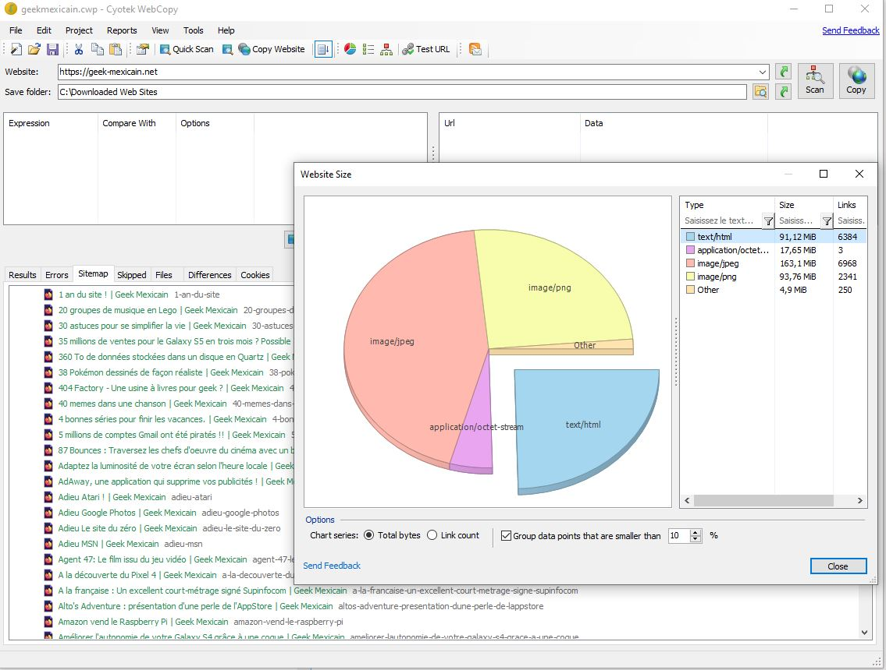
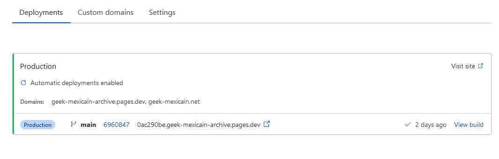

+++
title = "How to archive a website and host it as a static one?"
slug = 'how-to-archive-a-website-and-host-it-as-a-static-one'
aliases = ['/post/how-to-archive-a-website-and-host-it-as-a-static-one']
date = '2022-02-17T16:28:58.000Z'
draft = false
tags = ["archive","cloudflare","website","netlify","web"]
image = 'featured.jpg'
+++

A few days ago I wanted to archive a blog I was running with some friends years ago that didn't move since then. If in practice the task seems simple (extract content as static and host it somewhere), I struggled to find the right tools to do it. Hopefully, here is an article that will save you time doing the same thing :)  

  

## Archive the website locally

I tested a couple of services to do so and I finally stumbled upon [Cyotek WebCopy](https://www.cyotek.com/cyotek-webcopy), it's a super cool free tool that you can use to save a website locally.

  

WebCopy has plenty of features such as:

*   Going over forms and passwords (you can copy a password protected website)
*   Defining set of rules to avoid copying certain part of the website or some content types (ignore images for instance)
*   Setting the ton of parameters included like the user agent to use, the depth of the copy, the external links you want to include...
*   Generating a report and a website diagram at the of the analysis or of the copy

It's also important to note that when saving the website locally, WebCopy will automatically edit all the links inside your HTML pages so that it points to the local files.  

  

  

The [documentation](https://docs.cyotek.com/cyowcopy/current/default.html) is super complete, there are [some tutorials](https://www.cyotek.com/cyotek-webcopy/tutorial-1-copying-your-first-website) on their main website, well a nice tool which needs to be discovered.

  

When the copy is done, heads to the next step, your website is already ready to be uploaded online!

  

## Host your archive online

There are multiple services to host a static website online like Netlify or Github Pages. But the one I recommend here is [Cloudflare Pages](https://developers.cloudflare.com/pages/) that offers the best free tier in term of perfomances and hosting [limits](https://developers.cloudflare.com/pages/platform/limits).  

At this time, Cloudflare gives free hosting with unlimited bandwith and up to 20000 files (25MB max per file) which is quite insane offer.  

Now, upload the whole content of your archive on GitLab or GitHub repository (even if it's a private repo) and sign up to Cloudflare Pages. You'll have to connect to your repository hoster and then configure the project (leave everything as default, no build command, and main directory as "/").

When it's done, everytime you'll make a change to your repository Cloudflare will rebuild and serve your website.

  

  

Hope you enjoyed this post, let me know in the comments how it went!
