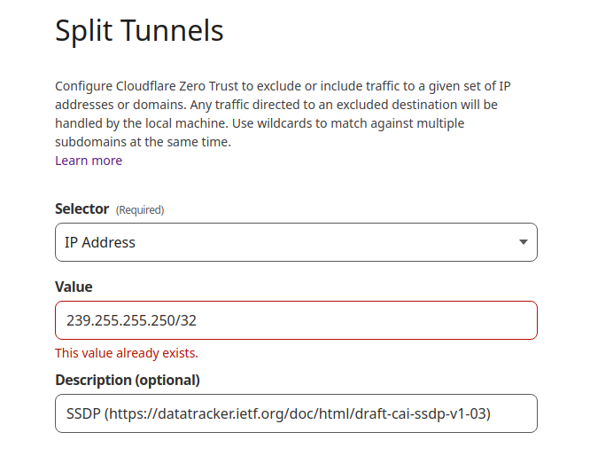
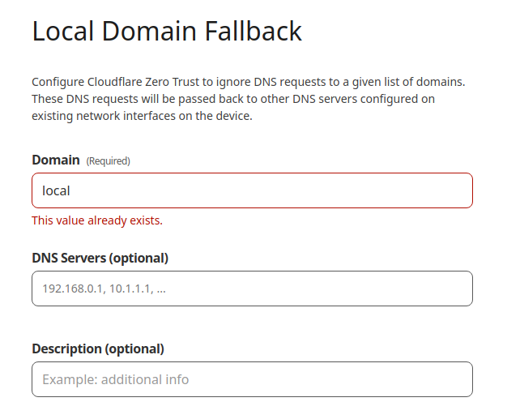

+++
title = "Allowing multicast protocols on Cloudflare Warp"
slug = 'allowing-multicast-protocols-on-cloudflare-warp'
aliases = ['/post/allowing-multicast-protocols-on-cloudflare-warp']
date = '2023-01-28T16:00:36.000Z'
draft = false
tags = ["mdns","ssdp","vpn","warp","protocol","cloudflare"]
image = 'featured.jpeg'
+++

I use Cloudflare Warp (and the warp-cli on Linux) as my main VPN to access a bunch of resources. I usually never turn it off but I recently started to play with IOT devices. And guess what most of them uses protocols that rely on multicast packets for discovering devices on your local network, for instance SSDP and mDNS.

## What are SSDP and mDNS?

[Multicast DNS](https://en.wikipedia.org/wiki/Multicast_DNS) (mDNS) allows to resolve hostname to IP addresses in small networks. It doesn't need any configuration (hence why it's often called zeroconf). On Linux you can use the Avahi daemon to discover devices on your network, on Apple devices you have Bonjour that implements it.  

When a mDNS client needs to resolve a hostname, it sends an IP multicast message to all devices on the network to identity itself. The device that has this hostname responds with a multicast message that includes its IP address. All the devices on the network updates their cache accordingly.

By default, all the devices that supports mDNS are represented by their <hostname>.local which is a TLD that is reserved for local networks.

[SSDP](https://en.wikipedia.org/wiki/Simple_Service_Discovery_Protocol) stands for Simple Service Discovery Protocol, it is mainly use for discovering devices using the UPNP (Universal Plug and Play) protocol. 

Similarly to mDNS it can send some M-SEARCH query messages to all devices on the network, but this time the responses are unicast to the requester. When a device using SSDP is added to the network, it notifies its presence to other devices by sending a multicast NOTIFY message, that way there is no need to constantly poll the network with M-SEARCH queries to find new devices.

I encountered this protocol while working on an UPNP client in NodeJS ([https://github.com/Mikescops/u...](https://github.com/Mikescops/upnp-client-ts)). While exploring this topic, I also found out that UPNP is often called Universal Pwn and Play and that SSDP is clearly not helping as it [may facilitate DDoS attacks](https://stormwall.network/knowledge-base/protocol/ssdp).

## How to allow this two protocols on Cloudflare Warp?

With Warp on, it the multicast queries are sent through the VPN tunnel and never gets propagated to your local network.

Head to your Zero Trust dashboard and open "Settings" > "WARP Client" > "Profile settings" > "configure". Then click on "Manage" on the section "Split Tunnels".

There you can add in the form the 2 multicast IPs (I left the RFC links if you the IPv6 ones) needed to allow SSDP and mDNS :

*   **239.255.255.250**/32 for SSDP  
    ([https://datatracker.ietf.org/doc/html/draft-cai-ssdp-v1-03](https://datatracker.ietf.org/doc/html/draft-cai-ssdp-v1-03))
*   **224.0.0.251**/32 for mDNS  
    ([https://datatracker.ietf.org/doc/rfc6762/](https://datatracker.ietf.org/doc/rfc6762/))

Also inside the "Local Domain Fallback" section, you should add the **.local** TLD so that classic DNS requests to this devices are handled by your local DNS servers configuration. 

I hope you learned a few things on this tutorial and that you can access your devices locally 👍
