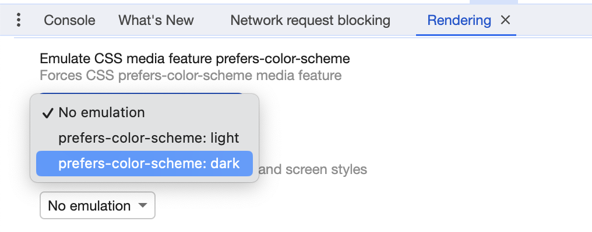

+++
title = "Building a dark mode theme switcher in SCSS"
slug = 'building-a-dark-mode-theme-switcher-in-scss'
aliases = ['/post/building-a-dark-mode-theme-switcher-in-scss']
date = '2023-12-22T16:50:07.404Z'
draft = false
tags = ["tutorial", "css", "scss", "dark-mode"]
image = 'featured.jpg'
+++

Few years ago I made a simple tutorial to explain [how to build a dark mode theme switcher in CSS](https://pixelswap.fr/entry/tuto-creer-un-theme-sombre-automatique-en-fonction-de-l-heure/). Today I want to update it and show you how to do it in SCSS and how to use the default system theme.

**Update 23/12/2023:** After many researches I updated this tutorial to use only pure CSS (and SCSS) to do the switch between the themes. The JS part is now only used to save the user's choice and is purely optional.

## Building the HTML

First, we need to create a simple HTML structure with a checkbox and a label. The checkbox will be used to switch the theme and the label will be used to style the button.

```html
<input type="checkbox" id="switch" />
<div class="app">
    <div class="container">
        <h1>My website</h1>
        <p>Lorem ipsum dolor sit amet consectetur adipisicing elit. Quisquam, voluptatum.</p>

        <label for="switch">
            <p class="btn btn-primary dark">Switch to dark</p>
            <p class="btn btn-primary light">Switch to light</p>
        </label>
    </div>
</div>
```

One important thing to notice in the HTML is that the you need to wrap your content that will be themed in a div (here named `app`) and place it after the checkbox. This is because we will use the `~` selector in CSS to style the content when the checkbox is checked.

_Side note: I used bootstrap in the example to quickly style the different elements._

## Let's create our switcher in pure SCSS

On the SCSS part, we will start by declaring the different colors we will use for the light and dark theme.

Then we will use the `prefers-color-scheme` media query to detect if the user has a dark mode enabled on his system. If it's the case, we will set the `--initial-dark-theme` variable to `initial` and the `--initial-light-theme` to nothing. If the user has a light mode enabled, we will do the opposite.

```scss
$bg-dark: #112f41;
$bg-light: #fff;
$color-dark: #fff;
$color-light: #000;

@media (prefers-color-scheme: light) {
    :root {
        --initial-light-theme: initial;
        --initial-dark-theme: ;
        --current-light-theme: initial;
        --current-dark-theme: ;
    }
}

@media (prefers-color-scheme: dark) {
    :root {
        --initial-light-theme: ;
        --initial-dark-theme: initial;
        --current-light-theme: ;
        --current-dark-theme: initial;
    }
}
```

Next, we will use the `:checked` pseudo-class to detect if the user has clicked on the button to switch the theme. If it's the case, we will set the `--current-dark-theme` variable to `var(--initial-dark-theme,) var(--initial-light-theme, initial)` and the `--current-light-theme` to `var(--initial-light-theme,) var(--initial-dark-theme, initial)`. The `var(--initial-dark-theme,)` will be used to set the dark theme if the user has a dark mode enabled on his system and the `var(--initial-light-theme, initial)` will be used to set the light theme if the user has a light mode enabled on his system. The `initial` value is used to set the default value if the user has no theme enabled on his system.

Ok that's a lot of variables, let's see how it look like.

```scss
#switch[type='checkbox']:checked ~ .app {
    --current-dark-theme: var(--initial-dark-theme,) var(--initial-light-theme, initial);
    --current-light-theme: var(--initial-light-theme,) var(--initial-dark-theme, initial);
}
```

Pretty simple right? Now we need to create a function to use the different variables we created.

```scss
@function darkMode($lightValue, $darkValue) {
    @return var(--current-light-theme, #{$lightValue}) var(--current-dark-theme, #{$darkValue});
}
```

The function will return the light or dark value depending on the current theme. This function can then be used inside any CSS property.

```scss
#switch[type='checkbox'] {
    display: none;
}

.dark {
    display: darkMode(block, none);
}

.light {
    display: darkMode(none, block);
}

.app {
    height: 100vh;
    width: 100vw;

    background-color: darkMode($bg-light, $bg-dark);
    color: darkMode($color-light, $color-dark);

    --title-color: #{darkMode(blue, green)};
}

h1 {
    color: var(--title-color);
}
```

As you can see in the example above, we can use the function inside any CSS property. We can also use it to create a new CSS variable like I did with the `--title-color` variable. That way you can for instance have generic color variables for the background or the text color for example.

## How to save the user's choice?

In order to save the user's choice, we can use the `localStorage` to store the theme.

```js
const themeSwitcher = document.querySelector('#switch');

const preferredSystemTheme = window.matchMedia('(prefers-color-scheme: dark)').matches ? 'dark' : 'light';
let savedTheme = localStorage.getItem('theme-mode') ?? preferredSystemTheme;

if (preferredSystemTheme !== savedTheme) {
    themeSwitcher.checked = true;
}

themeSwitcher.addEventListener('click', () => {
    localStorage.setItem('theme-mode', savedTheme === 'dark' ? 'light' : 'dark');
    savedTheme = localStorage.getItem('theme-mode');
});
```

The code above will check if the user has a dark mode enabled on his system and if it's the case, it will set the `savedTheme` variable to `dark`. If the user has a light mode enabled, it will set the `savedTheme` variable to `light`. Then, if the user has a different theme saved in the `localStorage`, it will set the checkbox to checked. Finally, when the user will click on the checkbox, it will save the new theme in the `localStorage`.

## Now the demo

That's it! We have a dark mode theme switcher in SCSS. You can see the result in the CodePen below.

<iframe height="500" style="width: 100%;" scrolling="no" title="Dark mode with pure SCSS and system theme" src="https://codepen.io/mikescops/embed/eYXYrjv?default-tab=css%2Cresult&editable=true&theme-id=light" frameborder="no" loading="lazy" allowtransparency="true" allowfullscreen="true">
  See the Pen <a href="https://codepen.io/mikescops/pen/eYXYrjv">
  Dark mode with pure SCSS and system theme</a> by Corentin Mors (<a href="https://codepen.io/mikescops">@mikescops</a>)
  on <a href="https://codepen.io">CodePen</a>.
</iframe>

<br>

### Bonus

If you want to test in your browser the system theme (this is for Chrome): inspect the page, go to the "Rendering" tab and change the theme to "Dark".

Enjoy and let me know what you think in the comments below!
