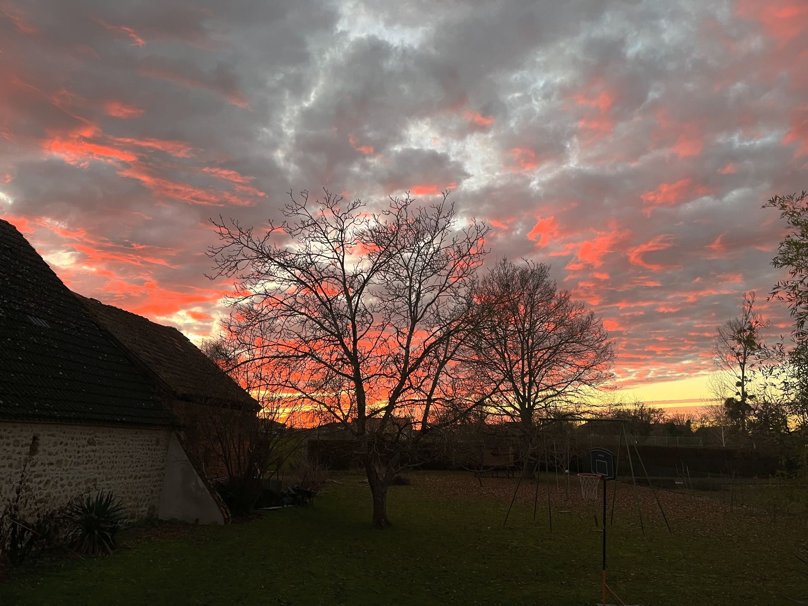

+++
title = "How to optimize image rendering with Hugo?"
slug = 'how-to-optimize-image-rendering-with-hugo'
aliases = ['/post/how-to-optimize-image-rendering-with-hugo']
date = '2023-12-26T09:27:42.484Z'
draft = false
tags = ["hugo", "tutorial", "image", "performance"]
image = 'featured.jpg'
+++

As you know this blog is built with [Hugo](https://gohugo.io/). I'm looking at ways to improve the performance of the website and one of the critical point is to serve the minimal amount of data to the user. In this article I will show you how to optimize the images rendering with Hugo.

## Exploration

Before implementing anything, let's set the expectations and see what we can do with HTML and Hugo to render optimized images.

### What I wanted to achieve

1. Serve the **smallest image possible** to the user depending on the device they are using. For instance, if the user is on a mobile device, I want to serve them a smaller image than if they are on a desktop.
1. Serve the images in the **WebP format** as it is more efficient than JPEG or PNG.
1. Ignore if the images are animated GIFs or if they are not available locally.

### What is the HTML attribute `srcset`?

The `srcset` attribute is used to provide the browser with a list of images to choose from. The browser will then select the most appropriate image to display based on the device's resolution and the size of the browser window.

The `srcset` attribute is used in conjunction with the `sizes` attribute which tells the browser the size of the image in CSS pixels. The `sizes` attribute is optional but it is recommended to use it to help the browser to select the most appropriate image.

You can read more about the `srcset` attribute on [MDN](https://developer.mozilla.org/en-US/docs/Learn/HTML/Multimedia_and_embedding/Responsive_images).

### How to convert images to WebP in Hugo?

Hugo has a built-in image processing feature that allows you to resize, crop, and perform other operations on images. It also allows you to convert images to WebP.

To convert images to WebP, you can do the following when you want to display an image:

```go-html-template
    {{- $image := .Resources.GetMatch .Params.image -}}
    {{- $image_webp := $image.Fill "542x290 Center webp q100" -}}

    
```

## Implementation

In Hugo there are [render hooks](https://gohugo.io/templates/render-hooks/) that allow to render some markdown elements with a custom template, they are located in the `layouts/_default/_markup` folder. We will use the `render-image.html` template to render our images.

### The `render-image.html` template

```go-html-template
{{- $image := .Page.Resources.GetMatch .Destination -}}

{{- /* The following is is used as a fallback if the image is not found or if it's a GIF. */ -}}
{{- $default := printf "" (.Destination | safeURL) $.PlainText $.Title -}}

{{- if $image -}}
    {{- if (strings.HasSuffix $image.Name ".gif") -}}
        {{- $default | safeHTML -}}
    {{- else -}}
        {{- $imageOriginalWidth := $image.Width -}}
        {{- $sizes := slice 458 768 1200 -}}
        {{- $srcset := slice -}}
        {{- $sizestag := slice -}}
        {{- range $sizes -}}
            {{- if lt (mul . 1.2) $imageOriginalWidth -}}
                {{- $thumb := $image.Resize (printf "%dx webp q100" .) -}}
                {{- $srcset = $srcset | append (printf ("%s %dw") $thumb.RelPermalink . ) -}}
                {{- $sizestag = $sizestag | append (printf ("(max-width: %dpx) 100vw") . ) -}}
            {{- end -}}
        {{- end -}}

        {{- if ne (len $srcset) 3 -}}
            {{- $thumb := $image.Resize (printf "%dx webp q100" $imageOriginalWidth) -}}
            {{- $srcset = $srcset | append (printf ("%s %dw") $thumb.RelPermalink $imageOriginalWidth ) -}}
            {{- $sizestag = $sizestag | append (printf ("%dpx") $imageOriginalWidth ) -}}
        {{- end -}}
        <figure class="image-caption">
            
            <figcaption>{{ with $.Title | safeHTML }}{{ . }}{{ end }}</figcaption>
        </figure>
    {{- end -}}
{{- else -}}
    {{- warnf "Unable to find '%s' -- ensure image exists alongside document in page bundle" .Destination -}}
    {{- $default | safeHTML -}}
{{- end -}}
```

In the above code, we first get the image from the page resources. Then we check if the image is a GIF or not. If it's a GIF, we display the image as is. If it's not a GIF, we create a `srcset` attribute with the different sizes of the image. We also create a `sizes` attribute with the different sizes of the image. Finally, we display the image with the `srcset` and `sizes` attributes.

If the number of sizes is less than 3 (in our case 458, 768, 1200), we add the original image to the `srcset` and `sizes` attributes. That way we are sure to display all the available image sizes.

A few notes:

-   We use the `warnf` function to display a warning in the console if the image is not found.
-   We convert the image to WebP with the `webp` parameter in the `Resize` function.
-   The `src` is set to the original image URL. This is used as a fallback if the browser doesn't support the `srcset` attribute.

### Demo time!

You can try to resize your browser here and look at the network tab to see the image below (I took this one myself recently) that is loaded depending on the size of the browser window.


Feel free to comment below with your thoughts or questions.

If you are interested in a different approach, after writing this I stumbled upon [this article](https://ryanfleck.ca/2023/perfected-image-rendering-in-hugo/) by Ryan Fleck which is very interesting too, give it a read!

### References

-   [Hugo documentation on Image Processing](https://gohugo.io/content-management/image-processing/)
-   [Resize images only if larger than target dimensions](https://discourse.gohugo.io/t/resize-images-only-if-larger-than-target-dimensions/23554/5)
-   [Hugo documentation on Render Hooks](https://gohugo.io/templates/render-hooks/)
