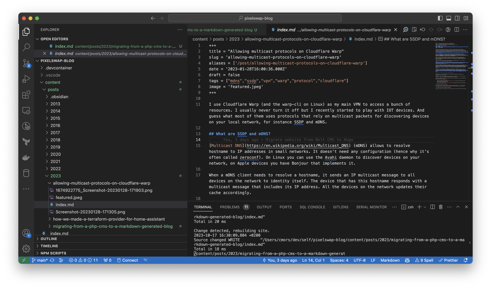

+++
title = "Migrating from a PHP CMS to a Markdown generated blog"
slug = 'migrating-from-a-php-cms-to-a-markdown-generated-blog'
aliases = ['/post/migrating-from-a-php-cms-to-a-markdown-generated-blog']
date = '2023-10-17T13:21:10.330Z'
draft = false
tags = ["bolt", "cms", "hugo", "markdown", "blog"]
image = 'featured.png'
+++

I made this blog back in 2012, and at this time I discovered an awesome framework called Bolt CMS. It was created by a small web agency based in the Netherlands where I had the chance to do my internship. The CMS is built out of Symfony and uses Twig as a templating engine. It was a perfect fit for me as I was learning HTML, CSS and PHP at this time.

## Why moving from Bolt CMS to a Markdown generated blog?

CMS are great don't get me wrong. But they have a particular target which is to make super simple content management for non technical people.

The main issue of running a CMS is quite obvious, you need to host it somewhere and it needs to be maintained. One of my principal concern was to make sure that the CMS was always up to date and secure. Which is, when you don't blog often, hard.

I also wanted to have a blog that is super fast (even tho' Bolt performances were crazy), to be able to write my posts in Markdown and to be able to version them with Git.

## How did I do it?

Firstly, I looked around what kind of static website generators were available. I tried a few of them (mostly in NodeJS but they were not maintained that well), but I ended up using [Hugo](https://gohugo.io/). It's a super fast static website generator written in Go. It's also super easy to use and has a lot of themes available.

One thing that I wanted to mention is how simple it is to install hugo on any system without even bothering wether it's made in Go or not.

### Migrating the design

Secondly, I wanted to stick as much as possible to the design I had on Bolt. Thankfully, the templating engine used by Bolt is quite close to the Go template used by Hugo.

For instance this is how you would display a post title in Bolt:

```go
{{ record.title }}
```

And this is how you would do it in Hugo:

```go
{{ .Title }}
```

And it's pretty much the same thing for looping over your content:

```go

    {{ record.title }}

```

_versus_

```go
{{ range .Pages }}
    {{ .Title }}
{{ end }}
```

On my previous theme, I was using Gulp to process the JS and the SCSS files. Let's be honest Gulp is quite dated and barely maintained.

But guess what? The extended version of Hugo has a built-in asset pipeline that can process your JS and SCSS files. It's fast and easy to use. I was able to remove Gulp and all the dependencies that came with it.

Now you can play to spot the differences:


### Migrating the content

Thirdly, I then had to migrate all my posts from Bolt (it was an SQLite database) to Hugo. I used the Bolt CMS extension called [Conimex](https://github.com/bobdenotter/conimex) to export all my database in YAML format and then converted it to JSON because it's much easier to parse.

From this I created a script to convert all my previous posts written in HTML and their metadata to Hugo Markdown format. I also had to migrate all the images and files that were uploaded to Bolt. I included in the script a step that would download all the files and put them in the right folder.

Here is the script I used to convert the posts:

````js
const fs = require('fs');

const entriesFile = fs.readFileSync('./entries.json');

const file = JSON.parse(entriesFile);

const entries = file.content;

if (!fs.existsSync('./output')) {
    fs.mkdirSync('./output');
}

const createFile = (entry) => {
    const { fields, taxonomies, createdAt, status } = entry;
    let { title, body, image, slug } = fields;
    const { tags } = taxonomies;
    const { filename } = image;

    if (status !== 'published') {
        return;
    }

    const tagsStr = tags ? JSON.stringify(Object.keys(tags)) : null;

    const outputPath = `./output/${slug}`;

    if (!fs.existsSync(outputPath)) {
        fs.mkdirSync(outputPath);
    }

    const filePath = `./files/${filename}`;
    const ext = filename.split('.').pop();
    const newFilename = `featured.${ext}`;
    if (filename) {
        const newFilePath = `${outputPath}/${newFilename}`;
        fs.copyFileSync(filePath, newFilePath);
    }

    const regex = /]+src="([^">]+)"/g;
    const matches = body.match(regex);

    if (matches) {
        matches.forEach((match) => {
            const regex2 = /src="([^">]+)"/;
            const match2 = match.match(regex2);
            const imgPath = match2[1];

            const imgPath2 = decodeURIComponent(imgPath).split('?')[0];

            // /files/2013-08/samsung-galaxy-s3.jpg
            const regex3 = /\/files\/(.*)/;
            const match3 = imgPath2.match(regex3);
            if (match3) {
                const imgFilename = match3[1];
                const imgFilename2 = imgFilename.split('/').pop();

                const newImgPath = `${outputPath}/${imgFilename2}`;
                fs.copyFileSync(`./files/${imgFilename}`, newImgPath);
                console.log(imgPath, imgFilename2);
                body = body.replace(imgPath, encodeURIComponent(imgFilename2));
            }

            // /thumbs/1000×1000×max/Screenshot-20230128-171305.png
            const regex4 = /\/thumbs\/.*\/(.*)/;
            const match4 = imgPath2.match(regex4);
            if (match4) {
                const imgFilename = match4[1];
                const imgFilename2 = imgFilename.split('/').pop();
                const newImgPath = `${outputPath}/${imgFilename2}`;
                fs.copyFileSync(`./files/${imgFilename}`, newImgPath);
                console.log(imgPath, imgFilename2);
                body = body.replace(imgPath, encodeURIComponent(imgFilename2));
            }
        });
    }

    const TurndownService = require('turndown');
    const turndownService = new TurndownService({
        headingStyle: 'atx',
        hr: '* * *',
        bulletListMarker: '*',
        codeBlockStyle: 'fenced',
        fence: '```',
        emDelimiter: '_',
        strongDelimiter: '**',
        linkStyle: 'inlined',
        linkReferenceStyle: 'full',
        br: '  ',
        blankReplacement: function (content, node) {
            return node.isBlock ? '\n\n' : '';
        },
        keepReplacement: function (content, node) {
            return node.isBlock ? '\n\n' + node.outerHTML + '\n\n' : node.outerHTML;
        },
        defaultReplacement: function (content, node) {
            return node.isBlock ? '\n\n' + content + '\n\n' : content;
        }
    });

    turndownService.keep(['iframe', 'video']);

    const result = turndownService.turndown(body);

    const content = `+++
title = "${title}"
slug = '${slug}'
aliases = ['/post/${slug}']
date = '${createdAt}'
draft = false
tags = ${tagsStr ?? '[]'}
image = '${filename ? newFilename : ''}'
+++

${result}
`;

    fs.writeFileSync(`./output/${slug}/index.md`, content);
};

entries.forEach((entry) => {
    createFile(entry);
});
````

It's probably not the best piece of code I've ever written but it did the job. And the funniest part is that it was mostly written by Github Copilot which is an amazing tool when it comes to write crappy but working code.

`Turndown` module was used to convert the HTML to Markdown. It's a great module but it's not perfect. I had to do some manual fixes on some posts like removing some bad spacing chars and making sure the iframe and video tags were not removed as there is no equivalent in Markdown.

For the image that are in the content, I used a regex to find the image path and then I copied the file to the new folder. I also had to replace the image path in the content with the new filename. It needed some manual fixes but I think I covered most of the cases.

### Migrating the comments

Well, cool thing that I am using [utterances](https://utteranc.es/) for the comments. It's a Github issues based comment system. So I didn't have to migrate anything.

I highly recommend using it if you want to have a comment system that is simple and hosted for free on your blog.

### Migrating hosting provider

For Bolt CMS, I was using my own server hosted at OVH. As for Hugo, I moved to Cloudflare Pages which is, in my opinion, the best free tier offer for static websites hosting.

Cloudflare Pages has a [nice documentation](https://developers.cloudflare.com/pages/framework-guides/deploy-a-hugo-site/) on how to deploy a Hugo website and they also support the extended version of Hugo which is perfect for me as I'm using the SASS compilation.

It also supports [custom domains](https://developers.cloudflare.com/pages/platform/custom-domains/) and SSL certificates for free. If you use an APEX domain (like I do) you will likely need to move to Cloudflare DNS to be able to use it. The good thing is that you can then benefit from the security and performance features of Cloudflare.

You can also use the [Bulk Redirect](https://developers.cloudflare.com/rules/url-forwarding/bulk-redirects/) tool to redirect the \*.pages.dev domain to your custom domain.

### The result!

Here is how it looks like now to edit content:



## Bonus : creating new posts easily

I built a simple script to allow me to create a new post easily. It will create a new folder with the current year and place a new Markdown file pre-filled with the post title slug and default metadata.

```js
const fs = require('fs');
const path = require('path');

const title = process.argv[2];

if (!title) {
    console.error('Please provide a title for the post');
    process.exit(1);
}

const slug = title.toLowerCase().replace(/ /g, '-');
const date = new Date().toISOString();
const year = date.split('-')[0];
const folderName = `${year}/${slug}`;
const filePath = path.join('content/posts', folderName, 'index.md');

if (fs.existsSync(filePath)) {
    console.error('Post already exists');
    process.exit(1);
}

const fileContent = `+++
title = "${title}"
slug = '${slug}'
aliases = ['/post/${slug}']
date = '${date}'
draft = false
tags = []
image = 'featured.jpeg'
+++
`;

fs.mkdirSync(path.join('content/posts', folderName), { recursive: true });
fs.writeFileSync(filePath, fileContent);

console.log('Post created successfully');
```

It's basic but very efficient and it saves me a lot of time copy pasting the metadata and creating the folder structure.

## Conclusion

It took me around 5 hours to migrate from Bolt to Hugo. I'm super happy with the result and I'm looking forward to writing more posts.

If you want to see the full project you can check it out on [GitHub](https://github.com/Mikescops/pixelswap).

In a future post I'll share some optimization tips with Hugo I used to make this blog faster.
