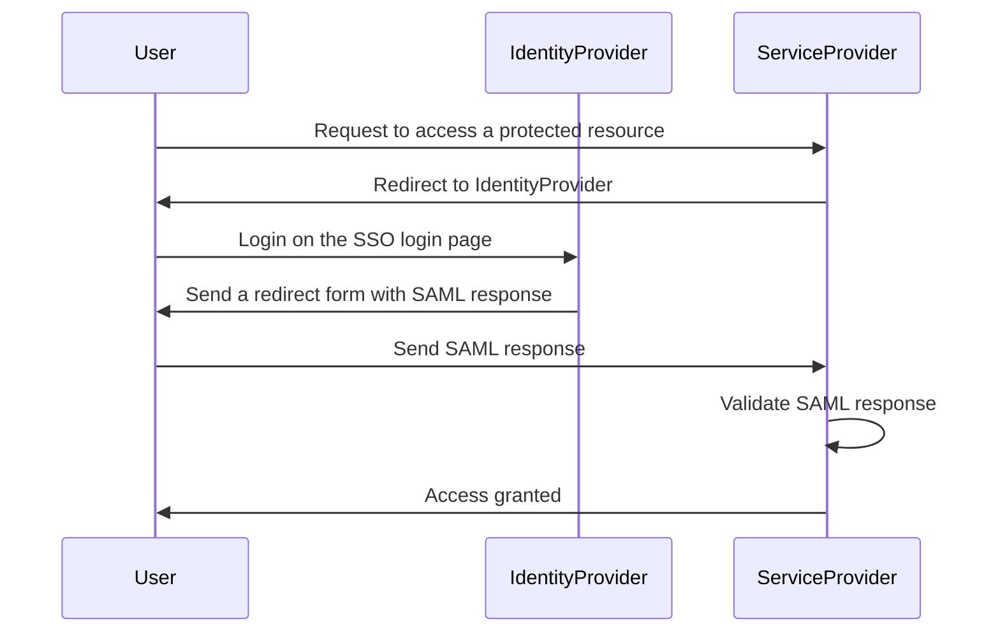

+++
title = "Making a SAML SSO authentication for a CLI in NodeJS"
slug = 'making-a-saml-sso-authentication-for-nodejs-cli'
aliases = ['/post/making-a-saml-sso-authentication-for-nodejs-cli']
date = '2024-07-25T14:14:34.260Z'
draft = false
tags = ['sso', 'saml', 'nodejs', 'cli']
image = 'featured.png'
+++

In this post, I will show you how to make a SAML SSO authentication for a NodeJS CLI application. This is useful when you want to authenticate users in a CLI application using a SAML SSO provider.

## Introduction

SAML (Security Assertion Markup Language) is an XML-based standard for exchanging authentication and authorization data between security domains. It is widely used for Single Sign-On (SSO) authentication in web applications.

The difficult part of implementing SAML SSO authentication in a CLI application is that SAML is designed for web applications, not CLI. However, with a little bit of creativity, we can make it work in a CLI application.

Here is a schema of how SAML SSO authentication works in a web app:



The user is redirected to the Identity Provider (IdP) to login, and then redirected back to the Service Provider (SP) with a SAML response. The SP validates the SAML response and grants access to the user.

The important part in our use case is how the SAML response is sent from the Identity Provider to the Service Provider. This is done by doing a POST request to the SP with the SAML response as the body of the request, the POST request is made thanks to a form that is automatically submitted by the browser.

Here is a simplified example of the web page generated by the Identity Provider to send the SAML response to the Service Provider:

```html
<!doctype html>
<html>
    <head>
        <title>Redirecting...</title>
    </head>
    <body>
        <form>
            <input type="hidden" name="SAMLResponse" value="PHNhbWxwOlJlc3BvbnN[redacted]fff" />
            <input type="hidden" name="RelayState" value="some-relay-state" />
        </form>
        <script>
            document.forms[0].action = 'https://sp.example.com/saml/acs';
            document.forms[0].submit();
        </script>
    </body>
</html>
```

Once the form is submitted, the browser will do a POST request to the SP with the SAML response as the body of the request. The SP will then validate the SAML response and grant access to the user.
This grant will, in most cases, be a cookie that will be used to authenticate the user in the future.

## What can we do in a CLI application?

From the introduction above, there are two possible solutions to authenticate a user in a CLI application using SAML SSO:

-   Use a tutored browser to authenticate the user and then extract the cookie from the browser or the response of the SP after the SAML vallidation is done to use it for later requests.
-   Use a tutored browser to simulate the browser behavior and intercept the SAML response to send it yourself to the SP. (This works well but breaks the SAML SSO usual flow.)

In both cases a tutored browser is needed because the SAML SSO flow requires a browser rediction to happen and it often happens that Identity Providers require extra steps like MFA (let's say using a passkey for instance) or CAPTCHA that are not possible to do in a CLI application.

## Implementation

For managing tutored browser, I'm a huge fan of Playwright, a NodeJS library that allows you to automate browsers. It's a great library that is easy to use and has a lot of features.

```typescript
export const SP_APP_REGEX = /https:\/\/my-service-provider.com/;

interface SSOParams {
    requestedLogin: string;
    serviceProviderURL: string;
}

/**
 * Open the Identity Provider URL in a browser and wait for the redirection to the Service Provider
 */
const openIdPAndWaitForRedirectURL = async (serviceProviderURL: string, userLogin: string): Promise<URL> => {
    return new Promise((resolve, reject) => {
        void (async () => {
            try {
                const browser = await chromium.launch({ headless: false, channel: 'chrome' });
                const context = await browser.newContext();
                const page = await context.newPage();

                page.on('framenavigated', (frame) => {
                    const url = page.url();
                    if (frame === page.mainFrame() && url.match(SP_APP_REGEX)) {
                        void browser.close();
                        resolve(new URL(url));
                    }
                });

                browser.on('disconnected', () => {
                    reject(new Error('Browser closed before SSO login'));
                });

                await page.goto(serviceProviderURL);

                // attempt to fill the login field (that's for fun)
                await page
                    .getByLabel('email')
                    .or(page.getByLabel('Username'))
                    .fill(userLogin)
                    .catch(() => null);
            } catch (error) {
                reject(error);
            }
        })();
    });
};

interface SSOAuthenticationInfo {
    login: string;
    ssoToken: string;
}

/**
 * Convert a URL into SSOAuthenticationInfo structure
 * @param url Redirection URL provided by the IdP with required data for SSO login
 * @returns SSOAuthenticationInfo data structure
 */
export const extractSsoInfoFromUrl = (url: URL): SSOAuthenticationInfo => {
    // Data is available in URL hash, within the form of search parameters.
    const search_params = new URLSearchParams(url.hash.substring(1));

    // To be rewritten properly
    return Object.fromEntries(
        Object.entries({
            login: '',
            ssoToken: ''
        }).map(([k]) => [k, search_params.get(k)])
    ) as unknown as SSOAuthenticationInfo;
};

/**
 * Perform the SSO verification process
 * @param requestedLogin The login requested by the user
 * @param serviceProviderURL The URL of the service provider
 * @returns The SSOAuthenticationInfo data structure
 */
export const doSSOVerification = async ({ requestedLogin, serviceProviderURL }: SSOParams) => {
    const redirectURL = await openIdPAndWaitForRedirectURL(serviceProviderURL, requestedLogin);
    return extractSsoInfoFromUrl(redirectURL);
};
```

In the code above, we use Playwright to open the Identity Provider URL in a browser and wait for the redirection to the Service Provider. We then extract the SAML response from the URL and return it.

This is a simplified example, and you may need to adapt it to your specific use case.

In our example the SSO information containing a called "ssoToken" (that will later be used to authenticate to the SP API) and the login is extracted from the URL, but this could be different depending on how the service provider manages sessions.

If you want to catch the SAML response from the Identity Provider you will need to intercept the form submission and extract the SAML response from the form.

Here is an example of how you can do it with Playwright:

```typescript
let samlResponseData;
const samlResponsePromise = new Promise((resolve) => {
    page.on('request', (req) => {
        const reqURL = req.url();
        console.log('Request URL:', reqURL);
        if (reqURL === spCallbackUrl) {
            samlResponseData = req.postData();
            if (browser) {
                void browser.close();
            }
            resolve();
        }
    });
});

await page.goto(serviceProviderURL);

await samlResponsePromise;

const samlResponse = new URLSearchParams(samlResponseData).get('SAMLResponse');
```

One of the drawbacks of this approach is that it requires a browser to be opened (obviously it may not work in some environments like a headless server) and that the user must be present to authenticate. Also, the used browser may not be the one the user is used to (we picked Chrome here) and it will use a new profile (so the user will have to perform login each time).

## Tips: How to use the existing Chrome session of the user

If you want to use the existing Chrome session of the user, you can request the user to launch Chrome with a specific flag to allow Playwright to access the debugging port of the browser.

The flag is `--remote-debugging-port=9222`.

On MacOS the command line would be:

```bash
open /Applications/Google\ Chrome.app --args --remote-debugging-port=9222
```

In term of code, you can use the following:

```typescript
const browser = await chromium.connectOverCDP('http://localhost:9222');
const context = browser.contexts()[0];

// instead of closing the browser at the end, just close the page
```

## Conclusion

Voilà, you have now a way to authenticate users in a CLI application using SAML SSO.

This is also how I implemented it in the [Dashlane CLI](https://github.com/Dashlane/dashlane-cli), and it works well.

I hope this post was helpful to you. If you have any questions or comments, feel free to leave them below.
I'm super curious if you find other ways to authenticate users in a CLI application using SAML SSO, so please share your thoughts!
