L'histoire débute il y a 7 ans, et comme toutes les bonnes aventures elle commence sur... les toilettes 🚽. Je réfléchissais à mon avenir et au nouveau projet que je pourrais bien monter. J'ai toujours voulu construire des trucs cool et pourquoi pas gagner ma croute avec ça.

Mon truc du moment c'était les setups, j'étais encore étudiant mais monter des ordis et aménager mon bureau j'ai toujours trouvé ça hyper classe. Je cherchais de l'inspiration sur quel accessoire ajouter ou quels composants mettre dans le PC. Les sources d'inspirations étaient pas nombreuses, le plus gros c'est le sub Reddit r/battlestations où les gens mettent des photos de leurs setups sans vraiment trop dire ce qu'il y a dedans.

C'est là que je me suis dit qu'il y avait un créneau à prendre et j'ai tout de suite vu une manière super simple et non intrusive de le monétiser 🤑. Le concept était donc de faire un site web communautaire où les utilisateurs pourraient poster leur setup, lister les composants et discuter entre eux. La monétisation, j'en parle tout de suite parce que ça permet de financer le projet, serait super simple avec juste des liens affiliés pour acheter les produits sur des magasins partenaires.

Je tire la chasse 🧻 (oui j'étais encore aux toilettes), et je pars chez un ami, Sam', pour lui pitcher le projet. Il trouve l'idée sympa et je commence à faire des maquettes, d'abord sur un carnet papier (je remplie des pages de carnets avec pleins d'idées) puis sur l'ordi avec du code très simple. 

Mon pote me rejoint ensuite et on commence à coder un vraie plateforme de 0 le 7 avril 2017 (en PHP avec CakePHP). Je passe pas mal de nuits blanches à faire, défaire, refaire pour arriver au résultat exact que j'avais en tête, un site esthétique, plaisant, qui donne envie de poster et d'être parcouru.

Le premier design ressemble à ça, c'est pas fou, mais c'est une base:
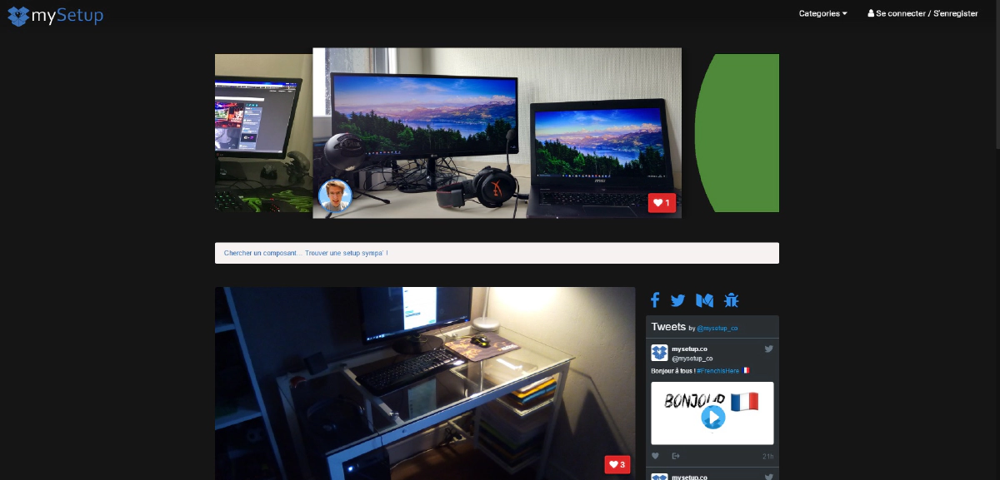

Le second un poil mieux:
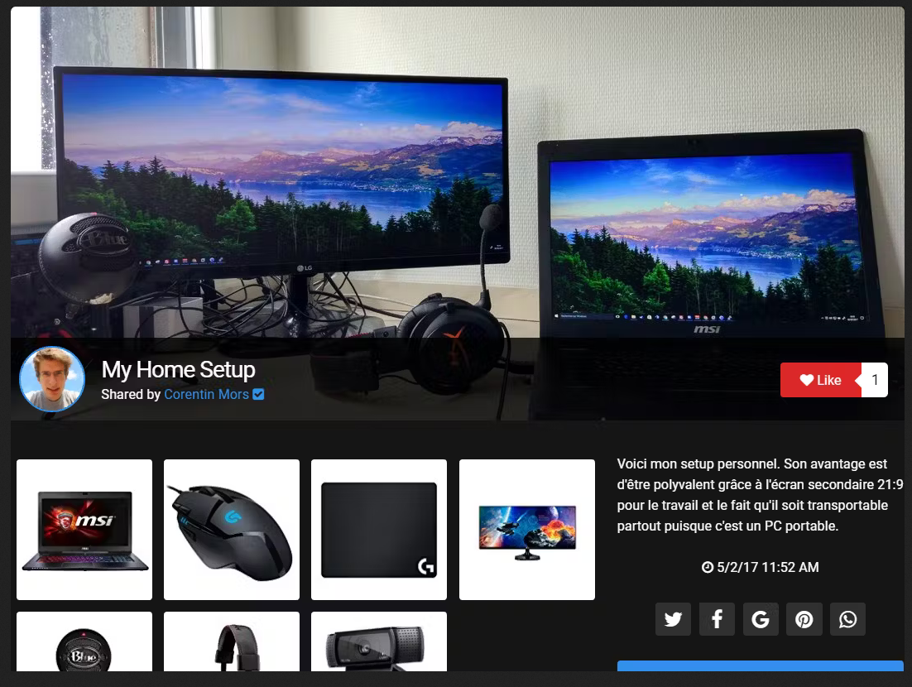

Le site s'appelle **mysetup.co**, c'était un nom de domaine dispo, ça se retient facilement et c'est un bon mot clé pour les moteurs de recherche. Après la v1, je design le logo et toute la charte graphique autour. Pendant ce temps mon pote dev plutôt tout le moteur backend du projet (base de données, serveur...) et il fait ça très très bien, trop bien pour quelqu'un qui n'a jamais fait de dev web avant 😅.

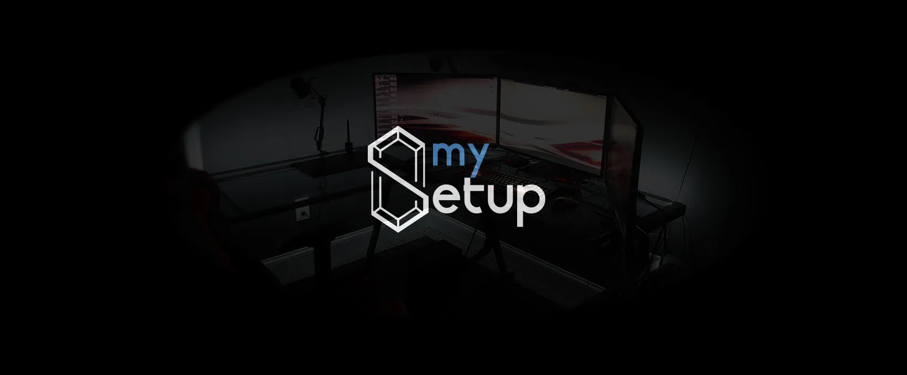

Une des choses qui me vient rapidement est que sur Twitch il était super courant que les viewers demandent quel est le setup des streamers et ces derniers mettent souvent au format texte tous leurs composants dans les blocs de bio en dessous du player. A ce moment là, Twitch dévoile une fonctionnalité game changer : les extensions 🧩. Je deviens un des premiers développeur à avoir accès aux extensions et je développe du coup une intégration entre Twitch et mysetup.co

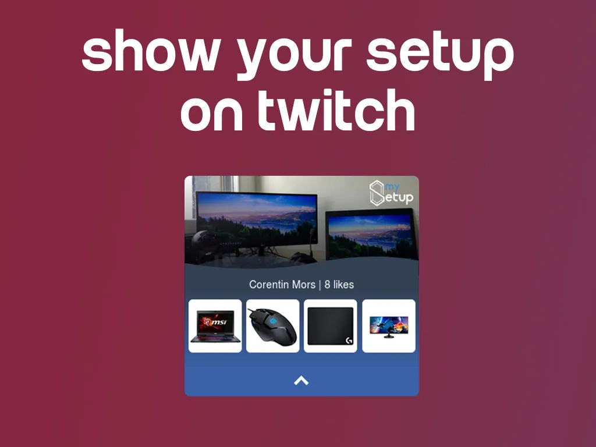

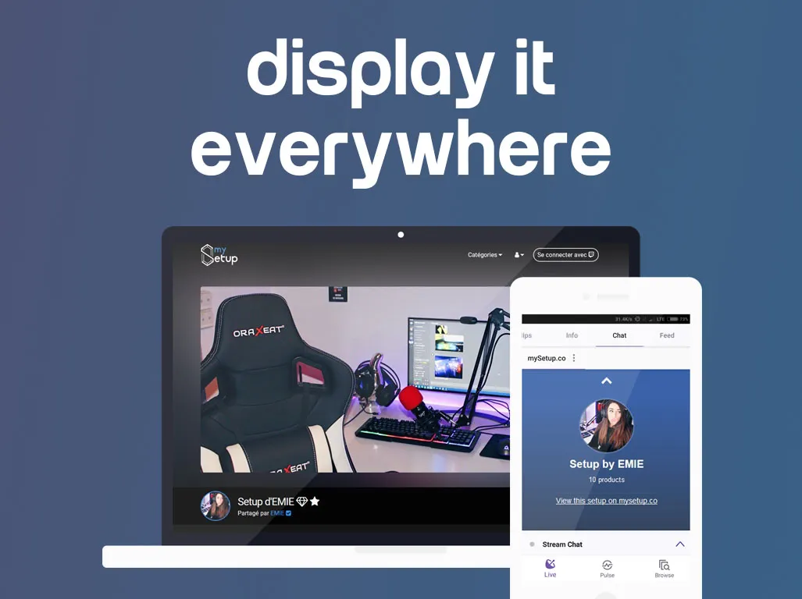

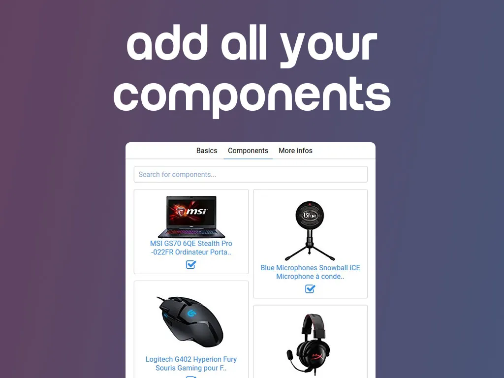

L'extension fonctionne bien, on discute même avec les développeurs de chez Twitch et un product manager nous repère pour faire une mise en avant de l'extension 🌟.

Même si ce n'est pas toujours avec la même intensité, le projet vie, et on continue de développer peu à peu certaines fonctionnalités. On a même fait un lancement sur Product Hunt qui s'est bien passé:

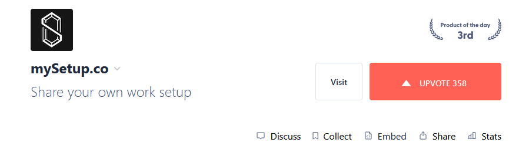

Et on a aussi fait partie de la [French Tech](https://lespepitestech.com/startup-de-la-french-tech/mysetupco).

Je ne me souviens pas du nombre d'itérations de design que j'ai fait, mais il y en a eu plein (et j'ai pas forcément tous les screenshots). J'ai essayé d'optimiser chaque bout du process pour que ce soit ultra simple de poster son setup et d'ajouter ses composants. Il y avait un éditeur d'image intégré, un système pour détecter les couleurs dominantes du setup...

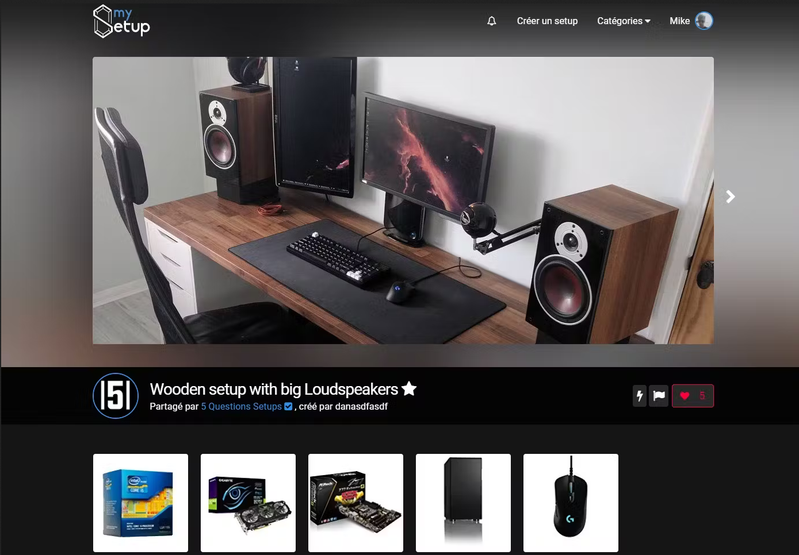

Derrière tout ça on avait du développer tout un système pour héberger le site, optimiser les images (car le stockage devenait vite un problème sur le long terme), avoir une interface d'administration pour modérer les contenus...

Et voilà un florilège de ce à quoi le site ressemblait à la toute fin.

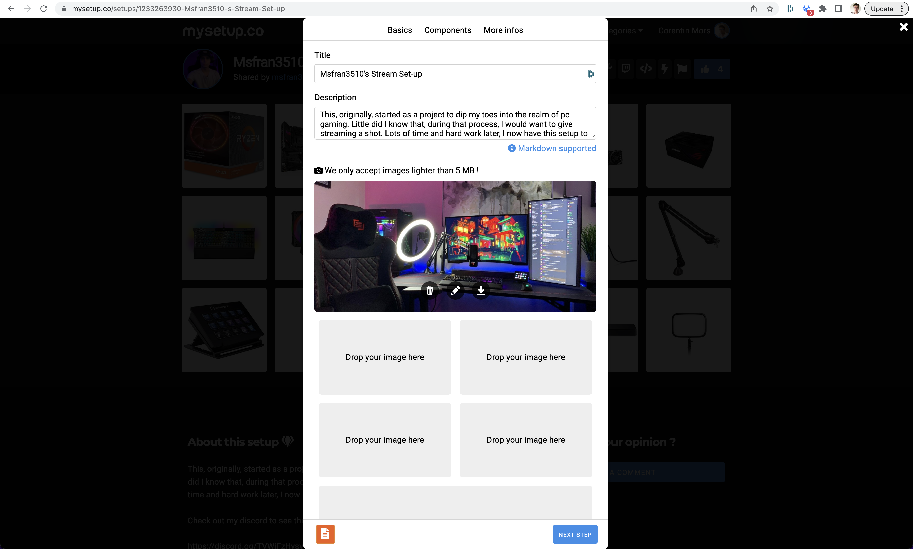

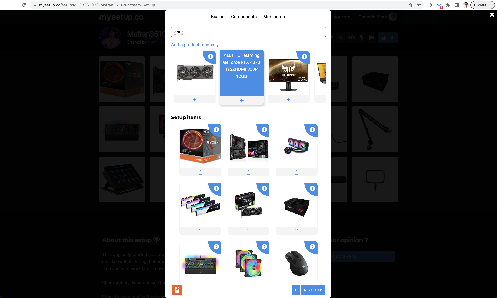

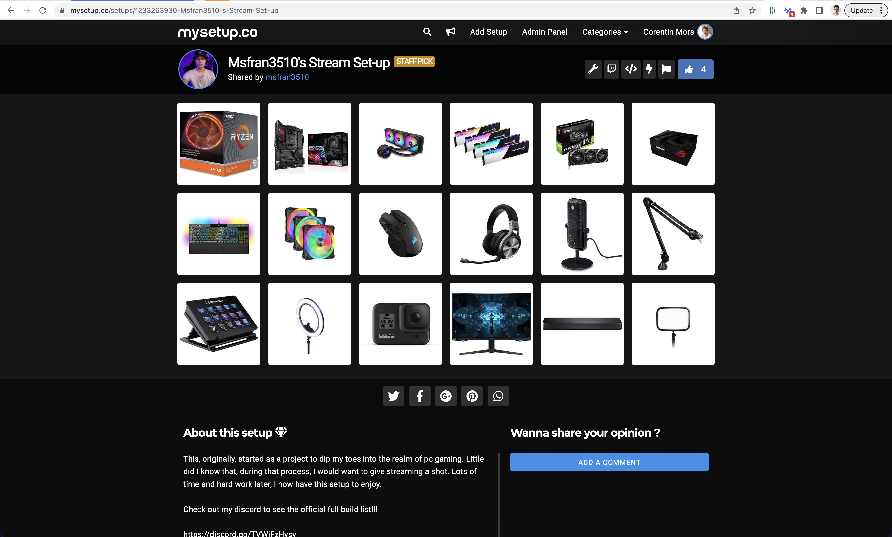

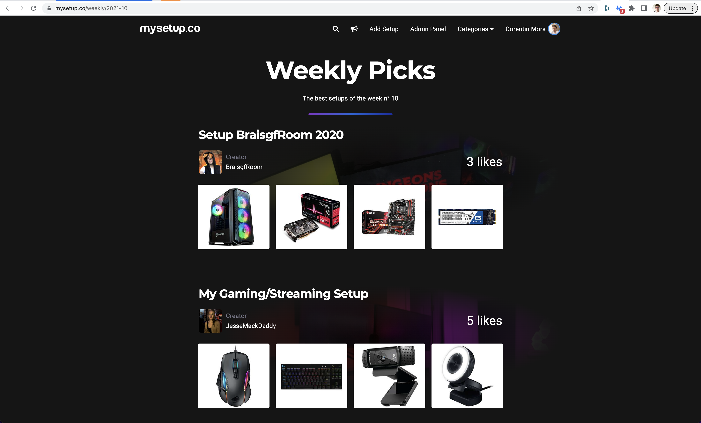

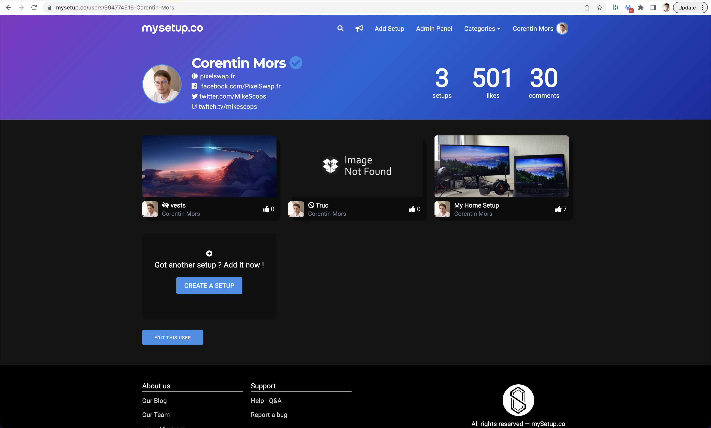

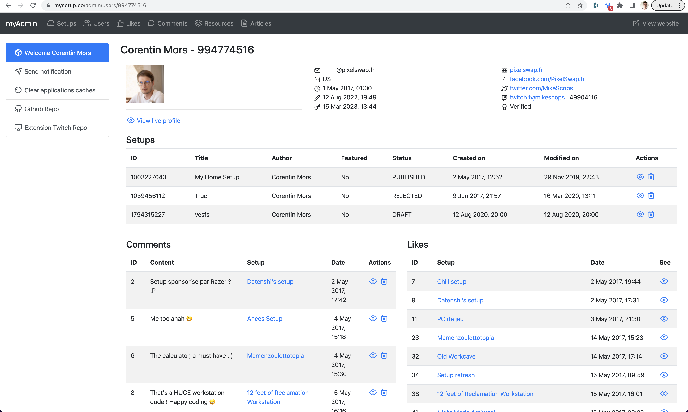

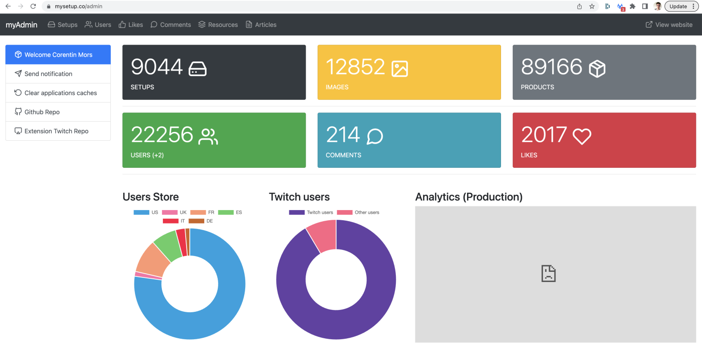

Même si l'aventure était cool, il faut avouer que maintenir ce site seul (car mon ami n'en avait plus du tout l'envie au bout d'un moment) était très difficile en parallèle du travail.  Après 5 ans, à développer et surtout payer tous les frais du site tout en ne gagnant pas un rond (ouais le modèle économique ne marchait pas), sans compter Amazon qui nous a pris l'idée de l'extension puis shadowban, j'ai pris la décision de tout couper.

C'était un projet vraiment incroyable et rien qu'en regardant les statistiques finales j'en reste encore aujourd'hui super fier :

- 🖥️ 9000 setups
- 🙋‍♀️ 22000 utilisateurs
- 🖼️ 13000 images
- ⌨️ 90000 produits référencés
- ❤️ 2000 likes

Voilà, merci d'avoir suivi ma petite histoire, et si vous avez une idée tout aussi farfelue, allez y lancez vous !
Le code du site est toujours [dispo sur GitHub](https://github.com/Mikescops/mysetup) pour les plus techos d'entre vous.

J'ai récemment rendu les clés du domaine, donc le memorial du site se trouve ici [mysetup.pixelswap.fr](https://mysetup.pixelswap.fr/).
