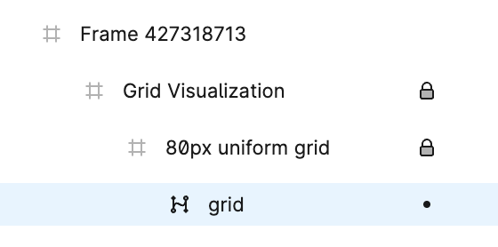
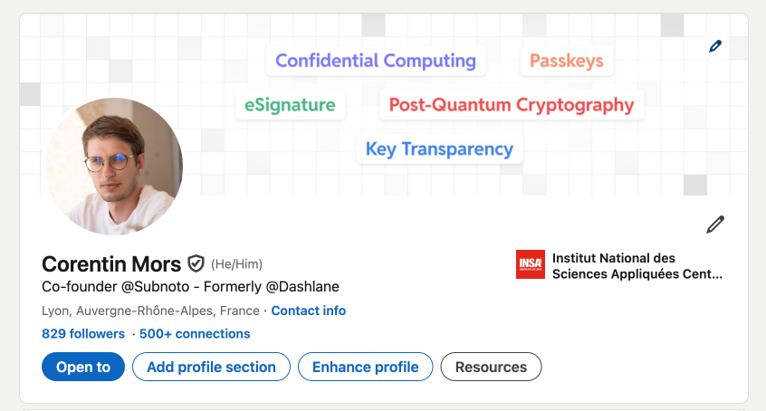

+++
title = "How to create a grid background in Figma"
slug = 'how-to-create-a-grid-background-in-figma'
aliases = ['/post/how-to-create-a-grid-background-in-figma']
date = '2025-02-02T18:22:52.232Z'
draft = false
tags = ["figma", "design", "tutorial"]
image = 'featured.png'
+++

As I embark on a new project named [Subnoto](https://subnoto.com), I’ve been exploring various ways to create appealing designs using Figma. While Figma is often used for web design, I’ve found it incredibly useful for other purposes as well, including marketing and branding content.

Recently, I decided to update my LinkedIn profile banner. I wanted to follow the latest trend of incorporating lines and wireframes into my designs. This led me to wonder how to create a grid background in Figma.

### Creating a Grid in Figma

Figma has a built-in layout system that makes it easy to create grids. Here’s how you can do it:

1. **Create a Frame:**
    - Press `F` to select the Frame tool.
    - Draw a frame of your desired size on the canvas.

2. **Add a Layout Grid:**
    - With the frame selected, go to the right-hand panel and click on the `+` icon next to "Layout Grid".
    - Change the layout grid type to "Grid".
    - Set the "Grid Size" to your desired value (e.g., 50).

This built-in grid is incredibly helpful for aligning elements and creating lines and squares. However, a limitation is that this grid will not be exported with your design.

### Exporting the Grid with Your Design

To export the grid, you’ll need the help of a free plugin called [Layout Grid Visualizer](https://www.figma.com/community/plugin/831003768229656707). Here’s how to use it:

1. **Install the Plugin:**
    - Go to the Figma Community and search for "Layout Grid Visualizer".
    - Install the plugin.

2. **Run the Plugin:**
    - Select the frame you created.
    - Run the Layout Grid Visualizer plugin. It will create a vector version of your layout grid that can be exported with your design.

Here’s an example of how the layout grid looks after using the plugin:

### Final Result

I applied this method to update my LinkedIn profile banner, and I’m quite proud of the result. Here’s how it looks on my [personal LinkedIn profile](https://www.linkedin.com/in/corentinmors/):

### Conclusion

Using Figma’s layout grid and the Layout Grid Visualizer plugin, you can easily create and export grid backgrounds for your designs. Whether you’re updating your LinkedIn banner or working on a new project like [Subnoto](https://subnoto.com), these tools can help you achieve a modern and professional look.